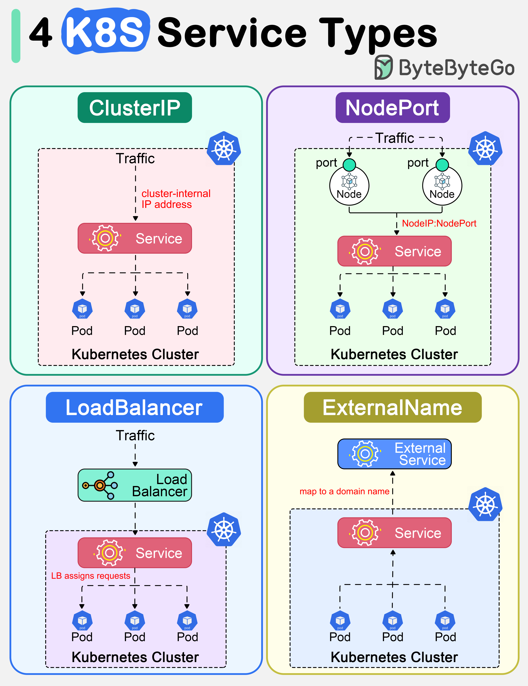

# Docker & Kubernetes Networking

[← Back to Cloud-Native](./README.md)

Container and orchestration networking: bridge, overlay, CNI, Services, Ingress.

## Table of Contents

- [Docker networking](#docker-networking)
- [Kubernetes networking](#kubernetes-networking)
- [Platform load balancers](#platform-load-balancers)
- [Policy and security](#policy-and-security)
- [eBPF, Cilium, and Hubble](#ebpf-cilium-and-hubble)
- [References](#references)

---

## Docker networking

Docker gives **containers** isolated **network namespaces** and connects them via **virtual Ethernet pairs (veth)** and **bridge** (or other drivers). Source: A-to-Z of Networking (Docker Networking).

The diagram below shows how Docker works: client, daemon, images, containers, and the flow from build to run. Source and image: [ByteByteGo – How does Docker work?](https://bytebytego.com/guides/how-does-docker-work/).


- **Bridge (default)** — A **software bridge** (e.g. `docker0`) on the host; each container gets a **veth** into the bridge and an IP from the bridge subnet (e.g. 172.17.0.0/16). **Container-to-container** on the same bridge: traffic goes by MAC at L2. **Container to internet**: NAT via host; **port publishing** (e.g. `-p 8080:80`) maps host port to container port.
- **Host** — Container shares the **host network namespace** (same interfaces, ports); no isolation; used for performance or when host network is needed.
- **Overlay** — For **multi-host** (e.g. Swarm): containers on different hosts communicate over an **overlay network** (encapsulated traffic). Used for clustering.

**Flow: container-to-container (same bridge)**

```text
  Container A (172.17.0.2)  →  eth0  →  veth pair  →  docker0 bridge (L2 lookup by MAC)
       →  veth pair  →  eth0  →  Container B (172.17.0.3)
  (All at Layer 2; no routing)
```

**Flow: container to internet**

```text
  Container  →  eth0  →  veth  →  docker0  →  host routing  →  NAT (host IP:port)  →  internet
  Response   ←  internet  ←  NAT  ←  host  ←  docker0  ←  veth  ←  eth0  ←  Container
```

**Flow: port publish (host:8080 → container:80)**

```text
  Client  →  host:8080  →  iptables / proxy  →  container eth0:80  →  app in container
```

---

## Kubernetes networking

Kubernetes assumes a **flat Pod network**: **every Pod has its own IP**; **Pods can reach each other and the internet** without NAT. A **CNI (Container Network Interface)** plugin implements this on the nodes. Source: A-to-Z of Networking (Kubernetes Networking).

The diagram below summarizes the **four main Kubernetes Service types** (ClusterIP, NodePort, LoadBalancer, Headless) and how they expose Pods. Source and image: [ByteByteGo – Top 4 Kubernetes Service Types](https://bytebytego.com/guides/top-4-kubernetes-service-types-in-one-diagram/).



- **CNI** — When a Pod is created, the **kubelet** calls the **CNI plugin** (e.g. Calico, Flannel, Cilium). The plugin **assigns** the Pod an IP, **attaches** the Pod to the node network (veth + bridge or overlay), and **configures** routing so other Pods and nodes can reach it. **IPAM** (IP address management) is often part of the CNI or a separate plugin.
- **Services** — Stable **clusterIP** (virtual IP) for a set of Pods; **kube-proxy** (or equivalent) programs **DNAT** so that traffic to the Service IP:port is sent to a backing Pod. **NodePort** and **LoadBalancer** expose Services outside the cluster.
- **Ingress / Gateway API** — **Ingress** is an L7 (HTTP) resource that defines **host/path** routing to Services; an **Ingress controller** (e.g. nginx, Envoy) implements it. **Gateway API** is the evolution: more general and role-oriented (Gateway, HTTPRoute, etc.).
- **Service mesh** — A mesh (e.g. Istio, Linkerd) adds a **sidecar proxy** per Pod and **control plane** for **mTLS**, **traffic policy**, and **observability**; routing is often still via Kubernetes Services, with the proxy intercepting outbound/inbound traffic.

---

## Platform load balancers

In cloud and Kubernetes, **load balancers** expose apps and distribute traffic.

- **Cloud LBs** — **ALB** (application/ L7): HTTP(S), host/path routing, TLS termination. **NLB** (network/ L4): TCP/UDP, low latency, static IP. **GLB** (global): anycast, DDoS mitigation, geo routing. **Cross-zone / cross-region**: traffic can be distributed across AZs or regions for HA and lower latency.
- **Kubernetes** — **Service type LoadBalancer** provisions a cloud LB (or metal LB on-prem) that targets the Service’s Pods. **Ingress** can front multiple Services with one external LB.

---

## Policy and security

- **Security groups (SG) / NSGs** — **Cloud**: firewall rules at the **instance** or **subnet** level (allow/deny by source, dest, port). **Kubernetes**: not built-in; often combined with **network policies** and cloud SG.
- **Network policies (K8s)** — **Allow/deny** Pod-to-Pod (and optionally egress) traffic by **labels** (namespace, Pod selector, port). Implemented by the CNI (e.g. Calico, Cilium). Default: many CNIs allow all; you restrict with policies.
- **Private access** — **Private endpoints** (cloud) or **internal Services** (K8s) so that traffic to managed services (DB, storage) or internal APIs stays on the private network and does not go over the public internet.

---

## eBPF, Cilium, and Hubble

**eBPF (extended Berkeley Packet Filter)** is a **kernel technology** that allows **safe**, **programmable** hooks in the Linux kernel (e.g. at socket, XDP, or TC level) without loading full kernel modules. From a **network** perspective, eBPF is used for **packet filtering**, **load balancing**, **observability**, and **security** (e.g. Cilium, Tetragon). **Cilium** is a **Kubernetes CNI** and network stack that uses **eBPF** to implement **Services**, **NetworkPolicy**, and **load balancing** directly in the kernel, often **replacing kube-proxy**. **Hubble** is Cilium’s **observability** layer: it uses eBPF to **capture flow** and **API** events and exposes **service maps** and **flow logs** for troubleshooting and security.

### Why eBPF matters for networking

- **Kernel-level, safe:** Programs run in a **verifier**-checked sandbox; they can **inspect** and **redirect** packets (e.g. at **XDP** — eXpress Data Path — or **TC** — Traffic Control) without copying every packet to userspace. So you get **high performance** and **rich logic** (e.g. L3/L4 load balancing, policy enforcement) **inside** the kernel.
- **Visibility:** eBPF can **attach** to socket or network events and **export** flow metadata (src/dst IP, port, pod, namespace) to userspace (e.g. Hubble, Prometheus). That gives **deep** observability without traditional **taps** or **sidecars** on every pod.
- **No kube-proxy:** Cilium can implement **Kubernetes Service** (ClusterIP, NodePort, LoadBalancer) and **ExternalIPs** using **eBPF** instead of **iptables** or **ipvs** (kube-proxy). That reduces **latency** and **complexity** and allows **advanced** load balancing (e.g. Maglev, consistent hashing).

**Visual (where eBPF runs):**

```text
  Pod A                    Node (Linux kernel)                    Pod B
  ┌─────┐                  ┌─────────────────────────────────┐   ┌─────┐
  │ app │ ── packet ──►    │  eBPF programs (XDP / TC /      │   │ app │
  └─────┘                  │  socket):                       │   └─────┘
                           │  - Policy (allow/deny)          │
                           │  - LB (Service → backend Pod)   │
                           │  - Observe → Hubble / metrics   │
                           └─────────────────────────────────┘
```

### Cilium (CNI + eBPF)

- **CNI:** Cilium **assigns** Pod IPs and **connects** Pods (via veth, plus optional overlay or direct routing). It **replaces** or **augments** kube-proxy: **Service** translation (ClusterIP → backend Pod) is done in **eBPF** (e.g. at **tc** or **socket** level), so no **iptables** rules for every Service.
- **NetworkPolicy:** **Kubernetes NetworkPolicy** (and Cilium’s **CiliumNetworkPolicy**) is **enforced** in eBPF: **allow/deny** by pod label, namespace, or CIDR. **L3/L4** and optionally **L7** (HTTP) policy.
- **Load balancing:** **Maglev**-style hashing and **DSR (Direct Server Return)** options for efficiency. **Bandwidth** and **latency**-aware options in some setups.
- **Multi-cluster and encryption:** Cilium can **encrypt** pod-to-pod traffic (e.g. WireGuard) and support **multi-cluster** mesh; from a **network** view, traffic is still **L3/L4** (or L7 for HTTP policies) with encryption and identity.

### Hubble (observability)

- **Flow visibility:** Hubble **collects** flow and **API** events from Cilium’s eBPF hooks and exposes them as **flow logs** (who talked to whom, when, which pod/namespace, verdict). You can **query** by namespace, pod, label, or IP/port.
- **Service map:** **Service dependency map**: which **service** calls which **service** (or external endpoint), so you see **east-west** and **north-south** traffic visually.
- **Integration:** **Hubble UI** (web) or **CLI** (`hubble observe`); metrics can be exported to **Prometheus** (e.g. request counts, drops by policy). Useful for **troubleshooting** (“why was this packet dropped?”) and **security** (unexpected flows, policy violations).

**Visual (Hubble flow):**

```text
  Pod A (frontend)  ──►  Pod B (backend)  ──►  External (internet)
       │                      │                        │
       │   eBPF observes      │   eBPF observes        │
       v                      v                        v
  ┌─────────────────────────────────────────────────────────────┐
  │  Hubble: flow log + service map                             │
  │  e.g. "frontend/default → backend/default :8080 ALLOWED"    │
  │       "backend/default → 1.2.3.4:443 ALLOWED"               │
  └─────────────────────────────────────────────────────────────┘
```

**Hands-on (conceptual):** With Cilium and Hubble installed (e.g. via Helm or Cilium CLI), you can run `hubble observe` to stream flows, or open the Hubble UI to see the service map. Filter by namespace, pod, or verdict (e.g. `hubble observe --namespace default --verdict DROPPED`). See Cilium and Hubble documentation for exact commands and install.

**Takeaway:** **eBPF** enables **high-performance**, **kernel-level** networking and visibility; **Cilium** uses it for **Kubernetes** CNI, **Services**, and **NetworkPolicy**; **Hubble** uses it for **flow logs** and **service maps**. Together they give a modern, observable, and policy-driven data plane for Kubernetes. See [security/10_Applications_Network_Perspective](../security/10_Applications_Network_Perspective.md) for containers from a security perspective.

---

## References

- [ByteByteGo – How does Docker work?](https://bytebytego.com/guides/how-does-docker-work/) (diagram; used with credit)
- [ByteByteGo – Top 4 Kubernetes Service Types](https://bytebytego.com/guides/top-4-kubernetes-service-types-in-one-diagram/) (diagram; used with credit)
- A-to-Z of Networking: Docker Networking, Kubernetes Networking
- [1_Cloud_Networking_Overview](./1_Cloud_Networking_Overview.md); [services/4_Load_Balancing_Proxies](../services/4_Load_Balancing_Proxies.md)
