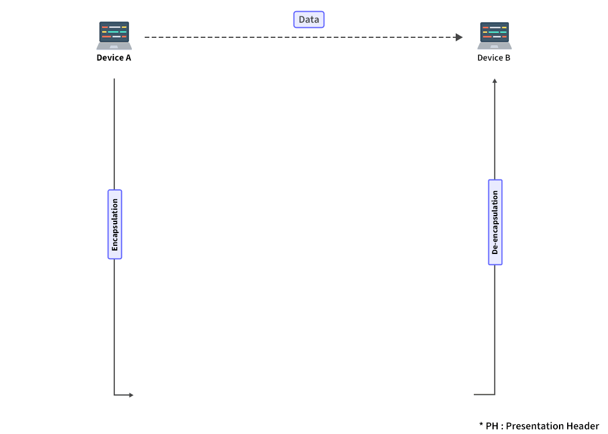
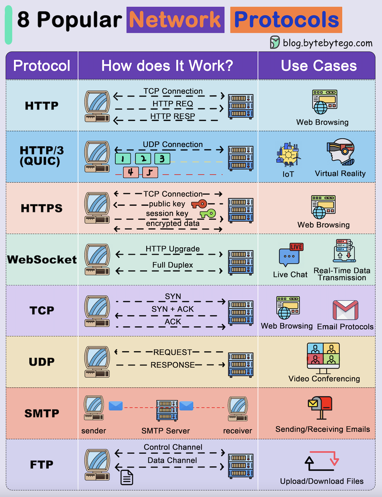

# Models: OSI & TCP/IP

[← Back to Foundations](./README.md)

Layered models used to describe network protocols and communication. Both OSI and TCP/IP describe how information is transmitted between two devices across a network; OSI is a seven-layer reference model, while TCP/IP is a four-layer framework that underpins the Internet.

## Table of Contents

- [OSI model](#osi-model)
- [TCP/IP model](#tcpip-model)
- [OSI and TCP/IP compared](#osi-and-tcpip-compared)
- [Encapsulation and data flow](#encapsulation-and-data-flow)
- [How a request flows through the TCP/IP model](#how-a-request-flows-through-the-tcpip-model)
- [Common network protocols (one diagram)](#common-network-protocols-one-diagram)
- [References](#references)

---

## OSI model

The **OSI (Open Systems Interconnection) model** was developed by the International Organization for Standardization (ISO). It is a **seven-layer** conceptual framework used to understand and design network communication. Each layer has a clearly defined function and works independently. The OSI model is widely used as a reference to understand how network systems function and to troubleshoot by focusing on one layer at a time.



The stack can be visualized as follows (Application at top, Physical at bottom; data flows down on send, up on receive):

```text
  ┌─────────────────────────────────────────────────────────────┐
  │  Layer 7: Application   (user apps, HTTP, FTP, DNS, ...)    │
  ├─────────────────────────────────────────────────────────────┤
  │  Layer 6: Presentation (encryption, compression, format)    │
  ├─────────────────────────────────────────────────────────────┤
  │  Layer 5: Session      (sessions, sync, dialog control)     │
  ├─────────────────────────────────────────────────────────────┤
  │  Layer 4: Transport    (TCP/UDP, segments, reliability)     │
  ├─────────────────────────────────────────────────────────────┤
  │  Layer 3: Network      (IP, routing, packets)               │
  ├─────────────────────────────────────────────────────────────┤
  │  Layer 2: Data Link    (Ethernet, frames, MAC)              │
  ├─────────────────────────────────────────────────────────────┤
  │  Layer 1: Physical     (bits, cables, signals)              │
  └─────────────────────────────────────────────────────────────┘
```

### Layer 1: Physical layer

The lowest layer. It is responsible for the **actual physical connection** between devices and transmits **raw bits** over the physical medium.

- **Data unit:** Bits.
- **Devices:** Hub, repeater, modem, cables, NICs.
- **Functions:**
  - Converts digital data into electrical/optical/radio signals for transmission; on receive, converts signals back into bits and passes them to the data link layer.
  - **Bit rate control** — Defines the transmission rate (bits per second).
  - **Bit synchronization** — Provides a clock so sender and receiver stay synchronized at the bit level.
  - **Transmission mode** — Defines how data flows between the two connected devices: simplex, half-duplex, or full-duplex (see [Physical layer](./3_Physical_Layer.md)).
  - **Physical topologies** — Specifies how devices are arranged (bus, star, ring, mesh, etc.).
- **When receiving:** Gets the signal, converts it to 0s and 1s, and sends the bit stream to the data link layer, which reassembles frames.

### Layer 2: Data link layer (DLL)

Responsible for **node-to-node delivery** of the message over the physical layer, ensuring data transfer is error-free between adjacent nodes.

- **Data unit:** Frames.
- **Devices:** Switches, bridges.
- **Sublayers:** Media Access Control (MAC) and Logical Link Control (LLC).
- **Functions:**
  - **Framing** — Breaks the packet from the network layer into frames according to the NIC’s frame size; attaches special bit patterns so the receiver can recognize frame boundaries.
  - **Physical (MAC) addressing** — Adds sender and receiver MAC addresses in the frame header. The receiver’s MAC is often obtained via ARP (“Who has that IP?”).
  - **Access control** — When a shared channel is used, the MAC sublayer determines which device may use the channel at a given time.
  - **Flow control** — Coordinates how much data can be sent before an acknowledgment to avoid overwhelming the receiver.
  - **Error control** — Detects and retransmits damaged or lost frames (e.g. using FCS).
- **Protocols:** Ethernet, PPP. See [Data link layer](./4_Data_Link_Layer.md).

### Layer 3: Network layer

Handles **transmission of data from one host to another** when they are in **different networks**. It is responsible for **logical addressing** and **routing**.

- **Data unit:** Packets.
- **Devices:** Routers, Layer 3 switches.
- **Functions:**
  - **Logical addressing** — Places sender and receiver IP addresses in the packet header so each device is uniquely identified across networks.
  - **Routing** — Chooses the best path from source to destination among available routes.
- **Protocols:** IP, ICMP, IGMP, OSPF, etc. See [Network layer](./5_Network_Layer.md).

### Layer 4: Transport layer

Provides **end-to-end delivery** of the complete message. It takes services from the network layer and provides services to the session/application layer.

- **Data unit:** Segments (TCP) or datagrams (UDP).
- **Functions:**
  - **Service point addressing (ports)** — Header includes port address so the message is delivered to the correct process on the destination host.
  - **Segmentation and reassembly** — Breaks the message into smaller units (segments); each has a header. The destination transport layer reassembles the message.
  - **Flow control and error control** — Ensures reliable delivery (e.g. TCP: acknowledgments, retransmission, sequencing).
- **Protocols:** TCP, UDP, SCTP, NetBIOS, PPTP. See [Transport layer](../transport/README.md).

### Layer 5: Session layer

Establishes, manages, and terminates **sessions** between two devices. It provides dialog control, synchronization, and authentication.

- **Data unit:** Data.
- **Functions:**
  - **Dialog controller** — Allows two systems to communicate in half-duplex or full-duplex.
  - **Synchronization** — Allows a process to add checkpoints (synchronization points) so that if an error occurs, data can be resynchronized and data loss is minimized.
  - **Session establishment, maintenance, termination** — Establishes, uses, and terminates the connection between the two processes.
- **Protocols:** NetBIOS, RPC, PPTP.

### Layer 6: Presentation layer

Also called the **translation layer**. It formats, encrypts, and compresses data so it can be transmitted over the network in a form the application layer can use.

- **Data unit:** Data.
- **Functions:**
  - **Translation** — Converts between formats (e.g. ASCII to EBCDIC).
  - **Encryption/decryption** — Encrypts data for security; decrypts at the receiver.
  - **Compression** — Reduces the number of bits to be transmitted.
- **Protocols/standards:** TLS/SSL, MIME; encoding standards such as JPEG, MPEG, GIF.

### Layer 7: Application layer

The top layer. It is implemented by network applications and provides the **interface** for user applications to access the network and for displaying received information.

- **Data unit:** Data.
- **Functions:**
  - **Application services** — Mail services, file transfer (FTAM), directory services, network virtual terminal (NVT).
  - **Protocol support** — SMTP, FTP, DNS, DHCP, HTTP, etc.
- **Protocols:** FTP, SMTP, DNS, **DHCP**, HTTP, and many others. These are **application-layer** protocols: they define message format and semantics. They **use** the transport layer (TCP or UDP) to send their messages—e.g. DNS and DHCP use **UDP**; HTTP typically uses **TCP**. So DHCP is **not** part of the transport layer; it is an application that runs **over** UDP (ports 67/68). See [Services](../services/README.md) and [DHCP](../services/8_DHCP.md).

### Protocols and PDUs by layer (OSI)

| Layer            | Role                          | PDU      | Examples (protocols)     |
|------------------|-------------------------------|----------|---------------------------|
| Physical         | Physical connection; bits     | Bits     | USB, SONET/SDH            |
| Data Link        | Node-to-node delivery         | Frames   | Ethernet, PPP             |
| Network          | Host-to-host across networks  | Packets  | IP, ICMP, IGMP, OSPF      |
| Transport        | End-to-end delivery           | Segments/Datagrams | TCP, UDP, SCTP |
| Session          | Session management            | Data     | NetBIOS, RPC, PPTP         |
| Presentation     | Format, encrypt, compress     | Data     | TLS/SSL, MIME             |
| Application      | User applications             | Data     | FTP, SMTP, DNS, DHCP (these run *over* TCP/UDP) |

---

## TCP/IP model

The **TCP/IP model** is a **layered networking framework** that explains how data is communicated between devices using standardized protocols. It is the **core framework of the modern Internet** and is defined in RFC 1122. It is **simpler and more practical** than the seven-layer OSI model and is **protocol-driven** (TCP, UDP, IP, HTTP, etc.).

The model is commonly described with **four layers**: Application, Transport, Internet, and Network Access (Link). Some references show five layers by splitting out the Physical layer from Network Access; here we use the standard four-layer view.

### 1. Application layer

The top layer, closest to the user. Applications (web browsers, email clients, file-sharing tools) interact with the network here.

- **Role:** Interface between user software and the lower layers; data formatting, session management, encryption for secure communication.
- **Protocols:** HTTP, FTP, SMTP, DNS, DHCP, and others. These are application-layer protocols; they **use** the transport layer (TCP or UDP)—e.g. DHCP and DNS use UDP, HTTP uses TCP. In TCP/IP, this layer effectively encompasses the OSI Application, Presentation, and Session layers.

### 2. Transport layer

Ensures **reliable or fast delivery** of data between devices: segmentation, ordering, flow control, and (for TCP) retransmission and error handling.

- **Role:** Segmentation and reassembly; multiplexing via port numbers; flow control; for TCP: reliable, connection-oriented delivery; for UDP: low-latency, connectionless delivery.
- **Protocols:** **TCP** (reliable, connection-oriented, ordered, retransmission, error checking) and **UDP** (lightweight, no guarantee of order or delivery, no retransmission). See [Transport layer](../transport/README.md).

### 3. Internet layer

Responsible for **addressing, packaging, and routing** packets so they can travel across networks and reach the correct destination.

- **Role:** Logical addressing (IP addresses); packet routing (best path); fragmentation and reassembly; support for ICMP (errors) and ARP (address resolution).
- **Protocols:** IP (IPv4, IPv6), ICMP, ARP, RARP.

### 4. Network Access layer (Link layer)

Responsible for **physically transmitting** data over the network hardware (cables, switches, wireless). It defines how data is formatted for the medium and how it reaches the next device.

- **Role:** Framing; MAC addressing; access control (sharing the medium, avoiding collisions); error detection (e.g. checksums, CRC); physical transmission of bits over Ethernet, fibre, Wi‑Fi.

### Sending and receiving data (TCP/IP)

**When sending (sender to receiver):**

1. **Application** — User software creates the data and passes it down.
2. **Transport** — Data is broken into segments; TCP or UDP adds control information.
3. **Internet** — Segments are encapsulated into packets with IP addresses for routing.
4. **Network Access** — Packets are converted into frames and transmitted over the physical medium.

**When receiving (at destination):**

1. **Network Access** — Frames are received from the medium and checked for errors.
2. **Internet** — Frames are unpacked; packets are extracted and forwarded to the correct device by IP address.
3. **Transport** — Segments are reassembled; TCP corrects missing/corrupt data if used.
4. **Application** — Complete data is delivered to the user application.

### Advantages and limitations of TCP/IP

**Advantages:** Open standard; scalable from small networks to the global Internet; TCP provides reliability and integrity; platform-independent; widely used and well understood.

**Limitations:** Original design focused on data, not real-time multimedia (extra protocols needed); no built-in security (TLS/SSL, etc. added later); TCP adds overhead; layer boundaries less strict than OSI; can be complex for beginners.

---

## OSI and TCP/IP compared

| Aspect | OSI model | TCP/IP model |
|--------|-----------|---------------|
| **Layers** | 7: Physical, Data Link, Network, Transport, Session, Presentation, Application | 4: Network Access (Link), Internet, Transport, Application (Physical often implied in Network Access) |
| **Session** | Separate Session layer for connection/synchronization | No separate layer; handled within Application |
| **Presentation** | Separate Presentation layer for formatting/encryption | Handled within Application layer |
| **Origin** | Theoretical; developed by ISO for standardization | Practical; developed for ARPANET/Internet (DoD) |
| **Layer boundaries** | Strict; each layer independent with clear interfaces | More integrated; less strict boundaries |
| **Protocols** | No specific protocols; defines functions only | Defines specific protocols: TCP, UDP, IP, HTTP, etc. |
| **Use** | Reference for teaching and network design | Actual stack used by the Internet and most networks |

**Why TCP/IP is used over OSI:** TCP/IP is simpler (four layers), practical, and implemented everywhere on the Internet. OSI remains valuable for learning and for isolating problems to a single layer, but the real-world stack is TCP/IP.

---

## Encapsulation and data flow

As data moves **down** the stack (sender), each layer **encapsulates** the PDU from the layer above by adding its own header (and sometimes trailer): Application data → Transport (segment/datagram) → Network (packet) → Data Link (frame) → Physical (bits). As data moves **up** the stack (receiver), each layer **decapsulates** by removing its header and passing the payload to the layer above.

The diagram below (from [ByteByteGo – OSI Model Explained](https://bytebytego.com/guides/what-is-osi-model/)) shows how data is encapsulated and de-encapsulated when Device A sends to Device B over the network (e.g. via HTTP).


**Step-by-step (sender → receiver):**

```text
  DEVICE A (encapsulation)                          DEVICE B (de-encapsulation)
  ───────────────────────                          ─────────────────────────────
  Step 1: App layer    → add HTTP header           Step 6–10: Reverse process:
  Step 2: Transport    → add TCP/UDP header              strip headers layer by layer
           (src/dst port, sequence number)              until application data is read
  Step 3: Network     → add IP header
           (src/dst IP addresses)
  Step 4: Data Link   → add MAC header
           (src/dst MAC addresses)
  Step 5: Physical    → send as binary bits on wire  →  receive bits, pass up
```

**Why layers:** Each layer has a clear responsibility and uses its own header for processing; it does not need to interpret the payload from the layer above. This separation simplifies design, troubleshooting, and interoperability. Source: ByteByteGo – OSI Model Explained.

**Visual (encapsulation on send):**

```text
  SENDER (each layer adds header →)
  ┌──────────────────────────────────────────────────────────────────┐
  │ App    │  DATA                                                   │
  ├────────┼─────────────────────────────────────────────────────────┤
  │ Trans  │  [TCP/UDP Hdr]  DATA                                    │
  ├────────┼─────────────────────────────────────────────────────────┤
  │ Net    │  [IP Hdr]  [TCP/UDP Hdr]  DATA                          │
  ├────────┼─────────────────────────────────────────────────────────┤
  │ DLL    │  [Eth Hdr]  [IP Hdr]  [TCP/UDP Hdr]  DATA  [FCS]        │
  ├────────┼─────────────────────────────────────────────────────────┤
  │ Phys   │  10110010...  (bits on wire)                            │
  └──────────────────────────────────────────────────────────────────┘

  RECEIVER (each layer strips header, passes payload up)
```

**Example (e-mail):** At the application layer, the user writes the email. The presentation layer may encrypt and format it. The session layer manages the connection. The transport layer breaks the data into segments and adds port numbers and reliability information. The network layer adds IP addresses and routes the packets. The data link layer adds MAC addresses and frames the packets. The physical layer converts frames to bits and sends them over the medium. At the receiver, the process reverses: bits → frames → packets → segments → application data, and the email is displayed in the recipient’s client.

---

## How a request flows through the TCP/IP model

This section traces **one request** (e.g. “load a web page”) through the **TCP/IP** stack so you can see how each layer is used. The same idea applies in the OSI model with more layers; TCP/IP groups Session, Presentation, and Application into a single **Application** layer.

### Sender (client): request goes down the stack

1. **Application layer** — The browser (or app) decides to send a request. It uses an **application protocol** (e.g. HTTP) and chooses a **destination** (hostname, path) and **port** (e.g. 443 for HTTPS). DNS may be used first to resolve the hostname to an IP address (that resolution is itself a request flowing down and up the stack). The application produces **application data** (e.g. HTTP request) and passes it down.
2. **Transport layer** — TCP or UDP takes the data. It **segments** it (TCP) or forms **datagrams** (UDP), adds **source and destination port**, and for TCP: sequence numbers, checksum, flags (e.g. SYN, ACK). The result is a **segment** (TCP) or **datagram** (UDP). The transport layer passes this to the **Internet layer**.
3. **Internet layer (Network layer)** — IP takes the segment/datagram and adds the **IP header**: **source and destination IP**, TTL, protocol (6 = TCP, 17 = UDP), etc. It may **fragment** if the packet is too large for the next link (IPv4). The result is an **IP packet**. The packet is passed to the **link layer**.
4. **Network Access (Link) layer** — The stack needs to send the packet to the **next hop** (e.g. default gateway or final host). It uses **ARP** (or ND in IPv6) to get the **MAC address** of the next hop, then builds an **Ethernet (or other) frame**: destination MAC, source MAC, type (e.g. IPv4/IPv6), then the IP packet, then FCS. The **Physical layer** (often included in “Network Access”) turns the frame into **bits** and sends them on the wire (or wireless).

### On the wire and through the network

- The **frame** is transmitted on the **local segment**. If the destination IP is on another network, the frame goes to the **default gateway** (router). The **router** receives the frame (Physical → Link), strips the link header, looks at the **IP header**, does a **routing table lookup** (longest prefix match), **decrements TTL**, and **forwards** the packet: it puts a **new link header** (next hop’s MAC) and sends the frame out the correct interface. This **hop-by-hop** process repeats until the packet reaches the **destination host**.

### Receiver (server): request goes up the stack

1. **Physical / Network Access** — The NIC receives **bits**, reassembles the **frame**, checks FCS. The link layer strips the Ethernet (or other) header and passes the **IP packet** up.
2. **Internet layer** — The kernel checks the **destination IP** (matches this host), **protocol** (e.g. TCP), and may **reassemble** fragments. It then passes the **segment/datagram** to the **Transport layer**.
3. **Transport layer** — TCP or UDP looks at the **destination port** (e.g. 443). The kernel delivers the payload to the **process** that has the socket bound to that port (e.g. the web server). TCP reassembles the byte stream, handles retransmissions, and delivers in-order data to the application.
4. **Application layer** — The server process (e.g. web server) receives the **application data** (e.g. HTTP request), handles it, and may send a **response**. The **response** then flows **down** the server’s stack (Application → Transport → Internet → Link → Physical), over the network, and **up** the client’s stack in reverse; the browser finally displays the page.

### Summary (one request, round trip)

```text
  CLIENT (sender)                    NETWORK                    SERVER (receiver)
  ─────────────────                  ───────                    ──────────────────
  App:   HTTP request
    ↓
  Trans: TCP segment (ports, seq, data)
    ↓
  Net:   IP packet (src/dst IP, TTL, protocol)
    ↓
  Link:  Frame (src/dst MAC)  ────→  Routers forward by IP  ────→  Link: receive frame
    ↓                                                                  ↓
  Phys:  bits on wire                                               Net: check IP, pass up
                                                                          ↓
                                                                    Trans: demux by port → process
                                                                          ↓
                                                                    App: handle request, build response
                                                                          ↓
  App:   receive response  ←────────────────────────────────────  (response down then back)
```

So: **application data** is wrapped by **transport** (ports, reliability), then **network** (IP, routing), then **link** (MAC, framing), then **physical** (bits). Each hop (including routers) uses at least **Network** and **Link**; only the **end hosts** use **Transport** and **Application**. That is how a request flows through the TCP/IP model.

---

## Common network protocols (one diagram)

Network protocols are standard methods of transferring data between two computers. The diagram below summarizes **eight common protocols** and where they sit in the stack. Source and image: [ByteByteGo – Explaining 8 Popular Network Protocols in 1 Diagram](https://bytebytego.com/guides/explaining-8-popular-network-protocols-in-1-diagram/).



**Quick reference:**

| Protocol | Role |
|----------|------|
| **HTTP** | Fetches resources (e.g. HTML); client–server; foundation of the Web. |
| **HTTP/3** | Next major HTTP; runs on **QUIC** (UDP-based); faster responsiveness, better for mobile and VR. |
| **HTTPS** | HTTP with encryption (TLS) for secure communications. |
| **WebSocket** | Full-duplex over TCP; server can push real-time updates (gaming, trading, messaging). |
| **TCP** | Reliable, ordered delivery of packets; many application protocols run on top of TCP. |
| **UDP** | Sends packets without a prior connection; used when low latency matters more than reliability (voice, video). |
| **SMTP** | Transfer of electronic mail between servers and clients. |
| **FTP** | File transfer; separate control (e.g. port 21) and data channels. |

See [Transport layer](../transport/README.md) (TCP, UDP), [Services](../services/README.md) (HTTP, DNS, DHCP, etc.), and [security/2_Encryption_Tls](../security/2_Encryption_Tls.md) (TLS/HTTPS).

---

## References

- [ByteByteGo – OSI Model Explained](https://bytebytego.com/guides/what-is-osi-model/) (encapsulation diagram; used with credit)
- [ByteByteGo – Explaining 8 Popular Network Protocols in 1 Diagram](https://bytebytego.com/guides/explaining-8-popular-network-protocols-in-1-diagram/) (diagram; used with credit)
- [GeeksforGeeks – What is OSI Model? - Layers of OSI Model](https://www.geeksforgeeks.org/computer-networks/open-systems-interconnection-model-osi/)
- [GeeksforGeeks – TCP/IP Model](https://www.geeksforgeeks.org/computer-networks/tcp-ip-model/)
- [GeeksforGeeks – OSI and TCP/IP Model](https://www.geeksforgeeks.org/computer-networks/difference-between-osi-model-and-tcp-ip-model/)
- RFC 1122 – Requirements for Internet Hosts (TCP/IP layers)
