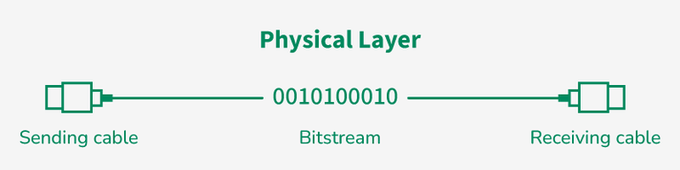

# Physical Layer

[← Back to Foundations](./README.md)

The physical layer is the lowest layer in the OSI model. It is responsible for transmitting **raw data bits** over the physical medium (cables, fibre, or wireless). It defines hardware standards, signal types, and the physical and electrical characteristics of the connection between devices.

## Table of Contents

- [Physical layer in OSI model](#physical-layer-in-osi-model)
- [Types of network topology](#types-of-network-topology)
- [Transmission modes](#transmission-modes)
- [Transmission media](#transmission-media)
- [Cabling standards (copper and fibre)](#cabling-standards-copper-and-fibre)
- [Power over Ethernet (PoE)](#power-over-ethernet-poe)
- [Physical layer security and protocols](#physical-layer-security-and-protocols)
- [References](#references)

---

## Physical layer in OSI model

### Role and functions

The physical layer:

- **Transmits raw bits** — Sends data as a stream of bits (0s and 1s) over the physical medium. On receive, it converts the signal back into bits and passes them to the data link layer.
- **Encoding and decoding** — Converts data into signals suitable for the medium (electrical, optical, or radio) and converts received signals back into data.
- **Modulation and demodulation** — Prepares data for transmission (e.g. modulation for analog lines) and retrieves it at the receiver (demodulation).
- **Bit rate and timing** — Controls the speed (bits per second) and timing of transmission so that sender and receiver stay synchronized (e.g. via a clock).
- **Transmission mode** — Defines how data flows: one-way (simplex), two-way alternately (half-duplex), or two-way simultaneously (full-duplex). See [Transmission modes](#transmission-modes) below.

It also defines **physical topologies** (how devices and cables are arranged) and **line configuration** (point-to-point vs multi-point). Hardware at this layer includes cables, connectors, plugs, NICs, hubs, repeaters, and modems.



### Line configuration

- **Point-to-point** — A dedicated link carries data only between two devices. High bandwidth; simple.
- **Multi-point** — A single shared link connects multiple devices. Cheaper but requires access control (who may transmit when).

### Layer 1 protocols and standards

The physical layer is implemented by a combination of hardware and software. Common protocols and standards include:

- **Ethernet (IEEE 802.3)** — Wired LANs; defines cabling, signaling, and data rates.
- **Wi-Fi (IEEE 802.11)** — Wireless LANs.
- **Bluetooth (IEEE 802.15.1)** — Short-range wireless.
- **USB (Universal Serial Bus)** — Short-distance device connections.

---

## Types of network topology

**Network topology** is the arrangement of devices (nodes) and connections (links) in a network. Two views:

- **Physical topology** — Actual layout of cables and devices.
- **Logical topology** — How data moves across the network (may differ from physical).

Choosing a topology affects performance, cost, reliability, and security.

**Topology shapes (conceptual):**

```text
  Point-to-point          Star                  Bus
  A ─────────── B          A──┐                 A──┬──B──┬──C──┬──D
                              │                       │
  Mesh (4 nodes)              ●── Hub/Switch      (single backbone)
  A───B                       │
   \/ \/                      C──┘
  C───D

  Ring                       Tree
  A───B                       Root
   \ /                         / \
    ●                          H1  H2
   / \                        / \
  D───C                    Leaf  Leaf
```

### Point-to-point

The simplest form: two nodes connected by a dedicated link. One is sender, one is receiver. Provides high bandwidth and is easy to reason about. Used for dedicated links (e.g. serial links between routers).

### Mesh

Every device is connected to every other device via **dedicated** channels (links).

- **Links:** For N devices, the number of dedicated links is **N(N−1)/2** (e.g. 6 devices → 15 links).
- **Ports:** Each device needs **N−1** ports (e.g. 6 devices → 5 ports per device).
- **Pros:** Fast, robust, fault isolation, security and privacy (no shared medium). Used in backbone and critical systems (e.g. military, aircraft).
- **Cons:** High cost (cabling and maintenance); installation and configuration are complex. Suited to a limited number of nodes.

### Star

All devices connect to a **central node** (hub or switch) via a cable. The hub can be passive (e.g. broadcast) or active (with repeaters). Coaxial or RJ-45 and Ethernet protocols (e.g. CSMA/CD) are common.

- **Cables:** N devices → N cables (one per device to the hub). Each device needs only one port.
- **Pros:** Easy to add devices and isolate faults; one link failure does not bring down others; relatively low cost (e.g. inexpensive coaxial).
- **Cons:** Central node is a single point of failure; performance depends on the concentrator. Common in office LANs and Wi‑Fi (devices connect to a central access point).

### Bus

All computers and devices attach to a **single cable** (backbone). Bi-directional; multi-point; **non-robust** — if the backbone fails, the whole segment fails. Traditional bus Ethernet used CSMA/CD.

- **Cabling:** One backbone cable plus N drop lines (one per device).
- **Pros:** Familiar technology; low cable cost for small networks; coaxial or twisted pair, historically up to ~10 Mbps.
- **Cons:** Heavy traffic increases collisions; adding devices can slow the network; security is low; backbone failure takes down the segment. Used in early Ethernet LANs and cable TV.

### Ring

Devices are connected in a **ring**; each node has exactly two neighbours. Data can flow in one direction (or both in dual-ring). **Token passing** is often used: a token circulates; a station must hold the token to transmit, then releases it.

- **Repeaters** — With many nodes, repeaters are used to avoid data loss (e.g. data passing through 99 nodes to reach the 100th).
- **Pros:** Low collision; relatively cheap to install and expand; high data transmission speed.
- **Cons:** Single node or link failure can break the ring; troubleshooting is harder; less secure.

### Tree

A **hierarchical** variation of star: a central hub connects to secondary hubs, which connect to devices. Data flows top-to-bottom (hub → secondary → devices) or bottom-to-top. Protocols such as DHCP and SAC are used. Multi-point and non-robust (backbone/root failure affects the tree).

- **Pros:** Can extend the network; can isolate and prioritize traffic; more devices per central hub, shortening signal distance.
- **Cons:** Reconfiguration when adding devices is difficult; cabling cost is high; central hub failure brings down the system. Example: organizational hierarchy (CEO → departments → managers → teams).

### Hybrid

Combination of two or more of the above (e.g. star + bus, star + ring). Flexible and scalable, but design and cost are higher. Example: campus network with a star backbone and bus or ring inside buildings.

### Why topology matters

- **Security** — Understanding connections helps secure the network.
- **Expansion** — The right topology makes it easier to add devices without disrupting the rest.
- **Reliability** — Star and mesh offer alternatives when a link fails.
- **Performance** — Matching topology to requirements improves behaviour.

---

## Transmission modes

**Transmission mode** (communication mode) defines **how data is exchanged** between two devices over the channel: direction of flow and whether both can transmit at the same time. It influences speed, performance, and the roles of sender and receiver.

### Simplex

Communication is **one-way only**: from sender to receiver. No reverse path; no feedback or acknowledgment.


- **Examples:** Keyboard to computer; traditional broadcast (e.g. TV, radio).
- **Pros:** Simple; full bandwidth for the one direction; lower cost.
- **Cons:** No delivery confirmation; no error reporting from receiver; not suitable for interactive or two-way systems.

**Visual:** `Sender ────────→ Receiver` (one direction only).

### Half-duplex

Communication is **two-way but only one device transmits at a time**. Devices take turns; the same channel is shared.


- **Examples:** Walkie-talkie; shared Ethernet in legacy bus/hub setups.
- **Pros:** Efficient use of one channel; more flexible than simplex; cost-effective.
- **Cons:** Cannot send and receive at the same time; possible delay and performance drop under heavy traffic; collisions if control fails.

**Visual:** `A ←═══════→ B` (one direction at a time; when A sends, B receives, and vice versa).

### Full-duplex

**Both directions at the same time.** Both devices can transmit and receive simultaneously (separate channels or divided bandwidth).


- **Examples:** Telephone network; modern Ethernet (switch with full-duplex links).
- **Pros:** No waiting; better for interactive applications; faster and more efficient.
- **Cons:** More complex hardware; higher bandwidth and cost.

**Visual:** `A ⇄ B` (two paths: A→B and B→A at the same time).

---

## Transmission media

**Transmission media** is the physical or wireless channel that carries data signals between devices. Choice depends on **cost**, **distance**, **bandwidth**, **interference**, and **security**.

Media are broadly **guided** (wired, bounded) or **unguided** (wireless, unbounded).

### Guided media (wired)

Signals travel along a **physical path** (cable). Usually better security and higher data rates; path is well defined.

#### 1. Twisted pair

Two insulated copper conductors **twisted** together to reduce EMI and crosstalk. Multiple pairs can be in one cable. Very common; low cost; used in telephony and LANs.

- **UTP (Unshielded Twisted Pair)** — No extra shielding; twisting gives basic noise protection. Used in Ethernet LANs and telephones. Inexpensive and easy to install; limited distance and more susceptible to noise than STP.
- **STP (Shielded Twisted Pair)** — Metallic foil or braid around the pairs. Better EMI and crosstalk protection; more reliable in noisy environments; higher performance. Heavier, less flexible, and more expensive; installation is more involved.

#### 2. Coaxial cable

Central conductor, dielectric, **metallic shield**, and outer jacket. Better noise protection and higher bandwidth than twisted pair. Used in cable TV (CATV), broadband, and analog TV.

- **Pros:** Good signal quality; supports baseband (single channel) and broadband (FDM, multiple channels); less susceptible to EMI.
- **Cons:** Can be tapped (security); bulkier; needs proper grounding; more expensive than twisted pair.

#### 3. Optical fibre

Data is sent as **light** in a glass or plastic core; **total internal reflection** keeps the light in the core. Cladding has a lower refractive index. Very high bandwidth; long distance; low attenuation; immune to electrical EMI.

- **Pros:** High bandwidth; long reach; low loss; resistant to corrosion and EMI; compact and lightweight.
- **Cons:** Fragile; higher installation and equipment cost; splicing and handling are delicate.
- **Applications:** Backbone and long-haul networks, undersea cables, telecom, data centres, industrial and medical systems. WDM allows multiple wavelengths on one fibre.

### Unguided media (wireless)

Signals propagate through **air or free space** as electromagnetic waves. No physical path; suitable for mobility and long distance, but generally less secure and subject to interference.

#### 1. Radio waves

Electromagnetic waves that can **penetrate buildings** and do not require line-of-sight. Frequency range on the order of 3 kHz–300 GHz. Used for broadcast (AM/FM, TV), cordless phones, and wireless data.

- **Types:** UHF (TV, mobile), VHF (FM, TV), shortwave (AM). Transmitter and receiver (with demodulation) are the main components.

#### 2. Microwaves

**Line-of-sight** transmission; antennas must be aligned. Range depends on antenna height. Typically 1 GHz–300 GHz. Used for satellite links, long-distance terrestrial links, and mobile backhaul.

- **Pros:** High data rates; good for difficult terrain; no need to lay cable.
- **Cons:** Antenna cost and alignment; affected by obstacles and weather (rain, fog); security relies on encryption.

#### 3. Infrared

**Short range**; often **line-of-sight**. Cannot penetrate solid obstacles (reduces interference between nearby systems). Frequency range on the order of 300 GHz–400 THz. Used in remotes, wireless keyboards/mice, and short-range data links.

### Comparison (radio, microwave, infrared)

| Aspect        | Radio       | Microwave   | Infrared        |
|---------------|-------------|-------------|-----------------|
| Direction     | Omnidirectional | Highly directional | Directional, LOS  |
| Penetration   | Through buildings | Poor; LOS  | No; blocked by obstacles |
| Security      | Low         | Medium (with encryption) | Higher but short range |
| Attenuation  | Moderate    | Variable (weather) | High  |
| Typical use   | Broadcast, mobile | Satellite, long-distance | Short-range control and data |

### Transmission impairment

- **Attenuation** — Loss of signal strength over distance. Compensated by amplifiers (analog) or repeaters/regenerators (digital).
- **Noise** — Unwanted signals (thermal, induced, crosstalk, impulse) that can corrupt data.
- **Distortion** — Change in signal shape (e.g. different frequency components arriving at different times), affecting clarity and timing.

---

## Cabling standards (copper and fibre)

Choosing the right cable type and category ensures the link can support the **data rate** and **distance** you need. Standards are defined by **TIA/EIA** (copper) and **fibre** type (single-mode vs multimode).

### Copper: twisted-pair categories (TIA/EIA)

Ethernet over **twisted pair** uses **RJ-45** connectors. The **category** of the cable (and the quality of termination) determines maximum **bandwidth** and **reach**. Higher categories support higher frequencies and often longer runs at a given speed.

| Category | Max bandwidth (approx) | Typical use | Max distance (100 m typical for Ethernet) | Notes |
|----------|-------------------------|-------------|------------------------------------------|-------|
| **CAT5** | 100 MHz | 100BASE-TX, 1000BASE-T (short) | 100 m | Legacy; avoid for new installs. |
| **CAT5e** | 100 MHz | 1000BASE-T (1 Gbps) | 100 m | Enhanced crosstalk spec; common for 1 Gbps LAN. |
| **CAT6** | 250 MHz | 1000BASE-T, 10GBASE-T (short) | 100 m (1 Gbps); ~55 m (10 Gbps) | Tighter twist; often used for 1–10 Gbps. |
| **CAT6a** | 500 MHz | 10GBASE-T (10 Gbps) | 100 m | Augmented; full 100 m at 10 Gbps. |
| **CAT7** | 600 MHz | 10 Gbps and beyond | 100 m | Shielded; less common in typical LAN. |

**Visual (what you get per category):**

```text
  Cable run (same distance, different category):

  CAT5e  ───────────────→  1 Gbps @ 100 m   (typical office)
  CAT6   ───────────────→  1 Gbps @ 100 m; 10 Gbps @ ~55 m
  CAT6a  ───────────────→  10 Gbps @ 100 m  (data centre, high-speed access)

  Rule of thumb: for new builds, CAT6 or CAT6a for future 10 Gbps; CAT5e acceptable for 1 Gbps only.
```

**Design takeaway:** Match cable category to **switch and NIC** capability (e.g. 10 Gbps ports need CAT6a for 100 m). Poor termination or mixing categories can limit speed or cause errors.

### Fibre: single-mode vs multimode

**Optical fibre** carries **light** in a glass core. The **core diameter** and **mode** (how light propagates) define **distance** and **cost**.

| Type | Core size (typical) | Light source | Max distance (approx) | Typical use |
|------|---------------------|--------------|------------------------|-------------|
| **Multimode (MM)** | 50 µm or 62.5 µm | LED / VCSEL (short wavelength) | 100 m–550 m (depends on speed and grade) | Data centre, campus backbone, short links. |
| **Single-mode (SM)** | 9 µm | Laser | Kilometres to 100+ km | Long-haul, ISP, metro, between buildings. |

**Why two modes?**

```text
  Multimode:                    Single-mode:
  Many light paths (modes)       One mode (path)
  in a wider core.               in a narrow core.
  Shorter reach;                 Long reach;
  cheaper transceivers.          more expensive optics.

  [LED] ──→ ════════════→       [Laser] ──→ ───────────→
           wide core (MM)                 narrow core (SM)
           e.g. 50 µm                     e.g. 9 µm
```

**Connectors:** Common types include **LC** (small form factor, common on SFPs), **SC** (push-pull), **ST** (legacy). **Patch panels** and **transceivers** must match fibre type (MM vs SM) and connector; mixing SM and MM does not work.

**Design takeaway:** Use **multimode** for in-building or campus (cost-effective, 100 m–550 m). Use **single-mode** for long runs, ISP links, or when you need future flexibility without re-cabling.

---

## Power over Ethernet (PoE)

**Power over Ethernet (PoE)** delivers **electrical power** over the **same twisted-pair cable** used for data. Devices such as **IP phones**, **wireless access points**, **IP cameras**, and **sensors** can be powered from the **switch** (or a **midspan injector**) without a separate power outlet. This simplifies deployment and allows centralised **power backup** (UPS on the switch).

### How it works

- **PSE (Power Sourcing Equipment)** — The device that **supplies** power: typically a **PoE-capable switch** or a **PoE injector** (midspan) between a non-PoE switch and the device.
- **PD (Powered Device)** — The device that **consumes** power: phone, AP, camera, etc.
- **Detection and classification** — The PSE detects that a PD is connected (via a resistance signature); it may **classify** the PD’s power requirement (e.g. class 0–8) and then applies power. If no valid PD is detected, the port does not supply power (so non-PoE devices are not damaged).
- **Data and power** — Data uses the **data pairs** (e.g. 1-2, 3-6 for 10/100); power can be applied on the **same pairs** (Mode A) or on the **spare pairs** (Mode B, when all four pairs are present). Gigabit uses all four pairs for data; PoE standards use different schemes (e.g. phantom power) so data and power coexist.

**Visual (power flow):**

```text
  PoE switch (PSE)                    Powered device (PD)
  ┌─────────────────┐                 ┌─────────────────┐
  │  Data + power   │   Ethernet     │  Data + power   │
  │  on same cable  │ ──────────────→ │  Phone / AP /   │
  │  (twisted pair) │   (up to 100m)  │  Camera         │
  └─────────────────┘                 └─────────────────┘
        PSE                                  PD
  (supplies 15–90 W)                   (draws power per class)
```

### PoE standards (IEEE 802.3)

| Standard | Name | Max power at PSE (approx) | Typical use |
|----------|------|---------------------------|-------------|
| **802.3af** | PoE | 15.4 W | Phones, basic APs, simple cameras. |
| **802.3at** | PoE+ | 30 W | Dual-radio APs, PTZ cameras, thin clients. |
| **802.3bt** | PoE++ (Type 3 & 4) | 60 W (Type 3), 90 W (Type 4) | High-end APs, displays, small PCs. |

**Power budget:** A switch has a **total PoE budget** (e.g. 370 W). Each port draws up to its **class** (e.g. 30 W for PoE+). You must ensure the sum of powered ports does not exceed the budget; otherwise some ports may not get power or the switch may shut down PoE.

**LLDP and PoE:** Many switches use **LLDP** (or CDP on Cisco) to exchange **power** information: the PD can advertise its required power (e.g. via LLDP-MED or vendor TLVs), and the PSE can allocate or deny power. See [Data link layer – CDP and LLDP](./4_Data_Link_Layer.md#layer-2-discovery-cdp-and-lldp) for discovery protocols.

**Design takeaway:** For any deployment of IP phones, APs, or cameras, confirm **cable category** (data rate) and **PoE capability** (standard and budget). Use PoE+ or PoE++ where devices need more than 15 W.

---

## Physical layer security and protocols

### Security at the physical layer

Attacks can occur **before** any higher-layer software is involved:

- **Hardware manipulation** — Tampering with routers, USB ports, or other devices to introduce malware.
- **Cable tapping** — Physically connecting to cables to intercept data.
- **Wireless interception** — Capturing Wi‑Fi or other radio signals from outside.
- **Physical access** — Unauthorized access to server rooms or equipment (theft, damage).

Mitigations: physical access control, tamper detection, encrypted wireless links, and secure cabling and facilities.

### Applications of the physical layer

- Works with **wired** (Ethernet, fibre) and **wireless** (Wi‑Fi, Bluetooth) technologies.
- Provides **standards** for cables, connectors, and signalling so that equipment from different vendors interoperates.
- Ensures devices can **transmit and receive** raw bits over the chosen medium.

---

## References

- [GeeksforGeeks – Physical Layer in OSI Model](https://www.geeksforgeeks.org/computer-networks/physical-layer-in-osi-model/)
- [GeeksforGeeks – Types of Network Topology](https://www.geeksforgeeks.org/computer-networks/types-of-network-topology/)
- [GeeksforGeeks – Transmission Modes](https://www.geeksforgeeks.org/computer-networks/transmission-modes-computer-networks/)
- [GeeksforGeeks – Transmission Media in Computer Networks](https://www.geeksforgeeks.org/computer-networks/types-transmission-media/)
