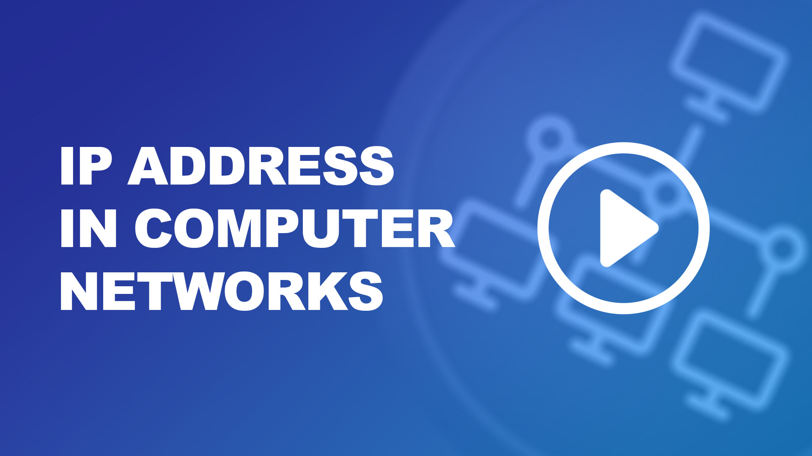
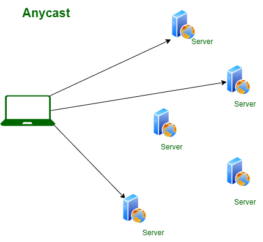
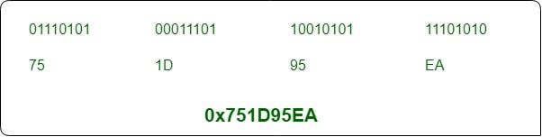
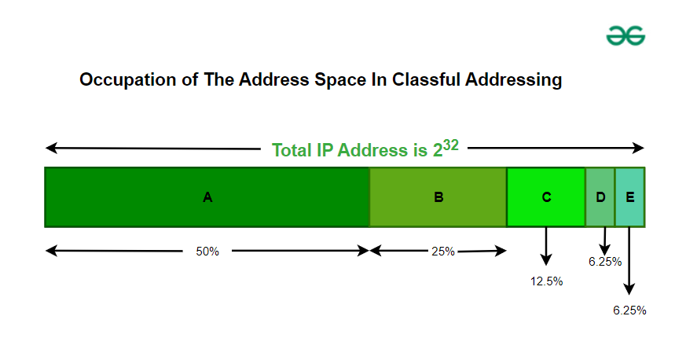
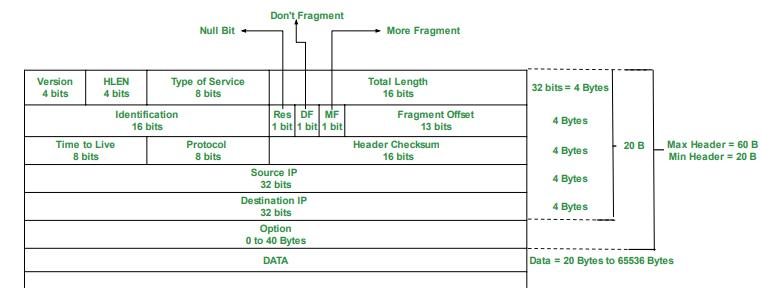
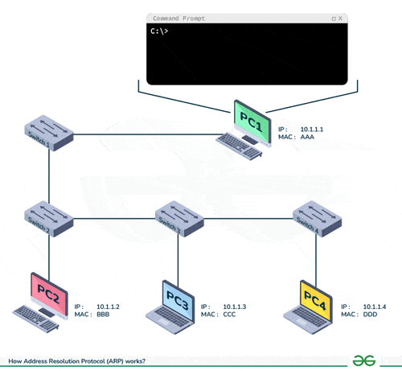
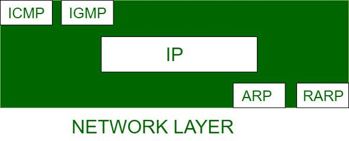
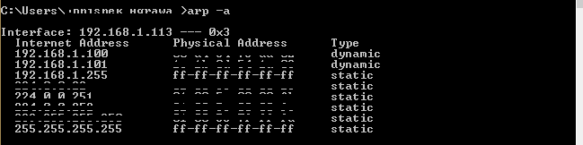
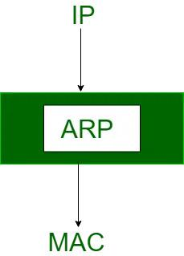

# Network Layer

[← Back to Foundations](./README.md)

The network layer (Layer 3) handles **logical addressing**, **routing**, and **host-to-host delivery** across multiple networks. It sits above the data link layer and below the transport layer. This file covers IP addressing (classful and classless), the IPv4 header, subnetting, ARP, ICMP, and a routing example.

## Table of Contents

- [Network layer in OSI model](#network-layer-in-osi-model)
- [What is an IP address?](#what-is-an-ip-address)
- [Types of IP (summary)](#types-of-ip-summary)
- [Classful IP addressing](#classful-ip-addressing)
- [How to calculate classful IP (range and count)](#how-to-calculate-classful-ip-range-and-count)
- [Classless addressing (CIDR)](#classless-addressing-cidr)
- [How to calculate classless IP (range and count)](#how-to-calculate-classless-ip-range-and-count)
- [IP building blocks](#ip-building-blocks)
- [IPv4 datagram header](#ipv4-datagram-header)
- [IPv4 vs IPv6](#ipv4-vs-ipv6)
- [How to calculate classless IPv6 (range and count)](#how-to-calculate-classless-ipv6-range-and-count)
- [Public and private IP addresses](#public-and-private-ip-addresses)
- [Introduction to subnetting](#introduction-to-subnetting)
- [VLSM and supernetting](#vlsm-and-supernetting)
- [ICMP, PING, TraceRoute](#icmp-ping-traceroute)
- [ARP (and ND for IPv6)](#arp-and-nd-for-ipv6)
- [Routing example](#routing-example)
- [Network layer protocols](#network-layer-protocols)
- [References](#references)

---

## Network layer in OSI model

The **network layer** is the third layer of the OSI model. It is responsible for **logical addressing**, **routing**, and **end-to-end packet delivery** across interconnected networks. Unlike the data link layer, which only delivers frames between adjacent nodes on the same segment, the network layer ensures data can travel from a **source host** to a **destination host** even when they are on **different networks**.

### Key responsibilities

- **Logical addressing** — Assigns unique **IP addresses** to devices so they can be identified and reached across networks.
- **Routing** — Determines the **best path** for packets to travel across multiple networks using routing tables and protocols (e.g. RIP, OSPF, BGP; see [routing-switching/](../routing-switching/README.md)).
- **Forwarding** — Moves packets from an router’s input interface to the appropriate output interface based on the **destination IP**.
- **Fragmentation and reassembly** — Splits large packets into smaller **fragments** when they exceed the **MTU** of a link; reassembles them at the destination.
- **Host-to-host delivery** — Delivers packets from sender to intended receiver across diverse networks.
- **Packetization** — Encapsulates transport-layer segments into **packets** with network-layer headers (e.g. IP).
- **NAT** — Maps private IPs to public IPs for internet access, conserving address space and adding a layer of indirection (NAT is often implemented at the edge; see [transport](../transport/README.md)).

### How the network layer works (high level)

1. Data from the transport layer is **encapsulated** into packets; **source and destination IP addresses** are added.
2. Each device has a unique **logical (IP) address**.
3. **Routers** examine the destination IP and choose the best path.
4. Packets move **hop-by-hop** across routers until they reach the destination network.
5. If a packet exceeds the **MTU**, it is **fragmented**; fragments are **reassembled** at the destination.
6. If the destination is unreachable, protocols such as **ICMP** can send error messages back to the source.

### Protocols at the network layer

- **IP (IPv4 / IPv6)** — Core protocol: logical addressing and delivery of packets.
- **ICMP** — Error reporting and diagnostics (e.g. destination unreachable, ping).
- **ARP** — Maps IP addresses to MAC addresses on the local link.
- **RARP** — Reverse: MAC → IP (largely obsolete).
- **NAT** — Translates between private and public IPs.
- **IPSec** — Encryption and authentication for IP.
- **MPLS** — Label-based forwarding (often considered between L2 and L3).

Routing protocols (RIP, OSPF, BGP) populate routing tables; they are covered in [routing-switching/](../routing-switching/README.md).

### Advantages and limitations

**Advantages:** Enables **inter-networking** of different types of networks; supports **scalability** via subnetting and hierarchical addressing; efficient routing with shortest-path and dynamic routing.

**Limitations:** **Fragmentation** adds overhead; routers may **drop** packets under load; **limited error control** (relies on upper layers for reliability); **no flow control** (congestion can occur).

---

## What is an IP address?

An **IP address (Internet Protocol address)** is a **unique numerical label** assigned to each device connected to a network that uses the Internet Protocol. It serves two main purposes: **identifying** the device and **locating** it so that data can be sent to and from it correctly.

- In simple terms, an IP address acts like a **digital address**: it allows data to be routed to the right device.
- IP addresses are used at the **network layer**; the data link layer uses **MAC addresses** for delivery on the local segment. ARP ties the two together (IP → MAC on the same LAN).

### Components of an IP address (IPv4)

- **Network portion** — Identifies the **network** to which the device belongs. Routers use this to decide where to send the packet.
- **Host portion** — Identifies the **specific device** within that network.
- **Subnet mask** — A 32-bit value that defines which bits are network and which are host. A bitwise AND of the IP address and the subnet mask yields the **network (subnet) address**.

**Example:** IP **192.168.1.10** with subnet mask **255.255.255.0**  
→ Network ID: **192.168.1.0**  
→ Host ID: **10**



### Types of IP (summary)

IP addresses can be classified in several ways. The following table and list cover the main **types of IP** you will see:

| Classification | Types | Meaning |
|----------------|--------|---------|
| **By version** | IPv4, IPv6 | 32-bit vs 128-bit; notation and features differ. |
| **By scope** | Public, Private | Routable on the internet vs only within a private network (RFC 1918). |
| **By function** | Unicast, Broadcast, Multicast, Anycast | One-to-one, one-to-all (local), one-to-group, one-to-nearest. |
| **By assignment** | Static, Dynamic | Permanently assigned vs assigned by DHCP (can change). |
| **By allocation** | **Classful**, **Classless** | **Classful**: fixed classes A/B/C (network/host boundary fixed by first bits). **Classless**: boundary given by prefix length (e.g. /24); no fixed classes. |

- **Classful** — The **class** (A, B, or C) is determined by the **first few bits** of the address. The network/host split is fixed: Class A = 8 network bits, Class B = 16, Class C = 24. Used historically; today we mostly use **classless**.
- **Classless** — The boundary is given by a **prefix length** (e.g. /24). Same notation is used regardless of the old “class”; e.g. 10.0.0.0/24 is a classless /24 even though 10.x.x.x was once Class A. **CIDR** is classless.

### Types of IP address (by function)

| Type | Purpose | Example use |
|------|---------|-------------|
| **Unicast** | One sender → one receiver | Web browsing, email, most traffic |
| **Broadcast** | One sender → all hosts on the local network | ARP, DHCP (IPv4 only) |
| **Multicast** | One sender → a group of receivers | IPTV, video conferencing (IPv4: 224.0.0.0–239.255.255.255) |
| **Anycast** | One sender → nearest of a group (by routing) | CDN, DNS (same IP at multiple locations) |




### IPv4 and IPv6

- **IPv4** — 32-bit address, dotted-decimal (e.g. 192.168.1.1). About 4.3 billion addresses; space is exhausted.
- **IPv6** — 128-bit address, hexadecimal with colons (e.g. 2001:0db8::1). Vastly larger space; no broadcast (uses multicast).

---

## Classful IP addressing

**Classful IP addressing** (1981–1993) divided the IPv4 address space into **fixed classes** (A, B, C, D, E). The **first few bits** of the address determined the class, which in turn fixed the boundary between **network ID** and **host ID**. This made allocation and routing simple but led to **waste** (e.g. a Class B for a small network). It was superseded by **classless addressing (CIDR)**.





### Classes (summary)

| Class | First octet range | Default mask | Network bits | Host bits | Use |
|-------|-------------------|--------------|--------------|-----------|-----|
| **A** | 1–126 | 255.0.0.0 | 8 | 24 | Very large networks |
| **B** | 128–191 | 255.255.0.0 | 16 | 16 | Medium networks |
| **C** | 192–223 | 255.255.255.0 | 24 | 8 | Small networks |
| **D** | 224–239 | — | — | — | Multicast |
| **E** | 240–255 | — | — | — | Reserved / experimental |

- **Class A** — First bit 0; 7 bits for network → 126 networks; 24 bits for host → ~16.7M hosts per network.
- **Class B** — First two bits 10; 14 bits for network → 16,384 networks; 16 bits for host → 65,534 hosts per network.
- **Class C** — First three bits 110; 21 bits for network → ~2M networks; 8 bits for host → 254 hosts per network.
- **Class D** — First four bits 1110; multicast group address.
- **Class E** — First four bits 1111; reserved.

In each unicast class, the **first** address of the block is the **network address** and the **last** is the **broadcast address**; they are not assigned to hosts. So usable hosts = 2^(host bits) − 2.

### Notation

- **Dotted decimal** — e.g. 192.168.1.1 (four octets, 0–255 each).
- **Hexadecimal** — Sometimes used in low-level debugging (e.g. each octet as two hex digits).

### How to calculate classful IP (range and count)

For **classful** addressing, once you know the **class** (from the first octet), the **network address**, **broadcast address**, **total addresses**, and **usable host range** are fixed by the class. Here is how to compute them.

**Step 1: Identify the class from the first octet**

| First octet (decimal) | Class | Network bits | Host bits |
|------------------------|-------|---------------|-----------|
| 1–126   | A | 8  | 24 |
| 128–191 | B | 16 | 16 |
| 192–223 | C | 24 | 8  |
| 224–239 | D (multicast) | — | — |
| 240–255 | E (reserved) | — | — |

**Step 2: Formulas (unicast A, B, C)**

- **Total addresses in the network** = 2^(host bits).
- **Network address** = first address in the block (host portion all 0s).
- **Broadcast address** = last address in the block (host portion all 1s).
- **Usable hosts** = 2^(host bits) − 2 (reserve network and broadcast).
- **First usable host** = network address + 1.
- **Last usable host** = broadcast address − 1.

**Step 3: Example — Class B 172.16.0.0**

- First octet **172** → **Class B** → 16 network bits, 16 host bits.
- **Network address:** 172.16.0.0 (host part 0.0).
- **Broadcast address:** 172.16.255.255 (host part 255.255).
- **Total addresses:** 2^16 = **65,536**.
- **Usable hosts:** 2^16 − 2 = **65,534**.
- **First usable host:** **172.16.0.1**
- **Last usable host:** **172.16.255.254**

So for **172.16.0.0** (Class B): the block runs **from 172.16.0.0 to 172.16.255.255**; **65,536** addresses total; **65,534** usable; host range **172.16.0.1 – 172.16.255.254**.

**Step 4: Example — Class C 192.168.1.0**

- First octet **192** → **Class C** → 24 network bits, 8 host bits.
- **Network address:** 192.168.1.0
- **Broadcast address:** 192.168.1.255
- **Total addresses:** 2^8 = **256**
- **Usable hosts:** 2^8 − 2 = **254**
- **First usable host:** **192.168.1.1**
- **Last usable host:** **192.168.1.254**

So for **192.168.1.0** (Class C): block **192.168.1.0 – 192.168.1.255**; **256** addresses; **254** usable; host range **192.168.1.1 – 192.168.1.254**.

**Quick reference (classful)**

| Class | Example network | Network address | Broadcast | Total | Usable | First host | Last host |
|-------|-----------------|-----------------|-----------|-------|--------|------------|-----------|
| A     | 10.0.0.0        | 10.0.0.0        | 10.255.255.255 | 2^24   | 2^24−2 | 10.0.0.1   | 10.255.255.254 |
| B     | 172.16.0.0      | 172.16.0.0      | 172.16.255.255 | 2^16   | 2^16−2 | 172.16.0.1 | 172.16.255.254 |
| C     | 192.168.1.0     | 192.168.1.0     | 192.168.1.255  | 2^8    | 254    | 192.168.1.1 | 192.168.1.254 |

---

## Classless addressing (CIDR)

**Classless addressing** does not use fixed classes. The boundary between network and host is given by a **prefix length** (e.g. /24), written after the address: **192.168.1.0/24**. This is **CIDR (Classless Inter-Domain Routing)** notation. It **reduces waste** by allowing allocation of only the needed number of addresses.

### Key ideas

- **Prefix length** — Number of bits used for the network (e.g. /28 → 28 network bits, 4 host bits).
- **Subnet mask** — 32-bit value with 1s in the network part and 0s in the host part. For /28: 255.255.255.240.
- **Subnetting** — A larger block is divided into smaller subnets by using more bits as network bits (longer prefix).
- **Supernetting** — Several contiguous blocks (e.g. Class C) are combined into one larger block (shorter prefix) for simpler routing.

### Example

- **192.168.1.0/28** → 16 addresses per subnet (14 usable hosts); subnet mask 255.255.255.240.
- **Network address** = AND(IP, subnet mask).
- **Broadcast address** = network address with all host bits set to 1.
- **First host** = network address + 1; **last host** = broadcast − 1.

### Useful formulas (classless)

- Number of addresses in a subnet: **2^(32 − prefix)**
- Usable hosts: **2^(32 − prefix) − 2** (if network and broadcast are reserved)
- Number of subnets (when borrowing n host bits): **2^n**

### How to calculate classless IP (range and count)

For **classless** (CIDR) addressing, the **prefix length** (e.g. /24) tells you how many bits are the **network part**; the rest are **host bits**. From that you can derive: **how many IPs**, **network address**, **broadcast address**, and **from which number to which number** (first and last usable host).

**Step 1: Use the prefix length**

- **Host bits** = 32 − prefix length. Example: /24 → 32 − 24 = **8** host bits.
- **Total addresses** = 2^(host bits). Example: /24 → 2^8 = **256**.
- **Usable hosts** (if you reserve network and broadcast) = 2^(host bits) − 2. Example: /24 → **254**.

**Step 2: Find network and broadcast from any IP in the block**

Given **any** IP in the block (e.g. 192.168.1.50/24):

- **Network address** = set all host bits of that IP to 0. For 192.168.1.50/24, the last octet is host → network = **192.168.1.0**.
- **Broadcast address** = set all host bits to 1. For 192.168.1.0/24 → **192.168.1.255**.

So the **full range** is **192.168.1.0 – 192.168.1.255**.

**Step 3: First and last usable host**

- **First usable host** = network address + 1 → **192.168.1.1**
- **Last usable host** = broadcast address − 1 → **192.168.1.254**

So for **any /24**: **256** addresses total; **254** usable; range **network+1** to **broadcast−1**. For 192.168.1.0/24 that is **192.168.1.1 – 192.168.1.254**.

**Worked example: “Given 10.5.0.0/24, how many IPs and from which to which?”**

| What | How | Result |
|------|-----|--------|
| Host bits | 32 − 24 = 8 | 8 |
| Total addresses | 2^8 | **256** |
| Usable hosts | 2^8 − 2 | **254** |
| Network address | 10.5.0.0 (host octet 0) | **10.5.0.0** |
| Broadcast address | 10.5.0.255 (host octet 255) | **10.5.0.255** |
| First usable host | 10.5.0.0 + 1 | **10.5.0.1** |
| Last usable host | 10.5.0.255 − 1 | **10.5.0.254** |

**Answer:** **256** IPs in the block (**254** usable). Range: **10.5.0.0** (network) to **10.5.0.255** (broadcast); usable hosts **10.5.0.1 – 10.5.0.254**.

**Worked example: /28 (e.g. 192.168.1.0/28)**

| What | How | Result |
|------|-----|--------|
| Host bits | 32 − 28 = 4 | 4 |
| Total addresses | 2^4 | **16** |
| Usable hosts | 2^4 − 2 | **14** |
| Network address | 192.168.1.0 (last octet: 0000) | **192.168.1.0** |
| Broadcast address | last octet 0000 + 15 = 1111 | **192.168.1.15** |
| First usable | 192.168.1.1 | **192.168.1.1** |
| Last usable | 192.168.1.14 | **192.168.1.14** |

**Answer:** **16** IPs (**14** usable). Range **192.168.1.0 – 192.168.1.15**; usable **192.168.1.1 – 192.168.1.14**.

**Subnet mask from prefix**

- Mask has **prefix** bits set to 1, rest 0. Example: /24 → 255.255.255.0. /28 → 255.255.255.240 (last octet: 11110000 = 240).

**Summary: one-line answers**

- **“How many IPs in a /24?”** → 2^(32−24) = **256** (254 usable).
- **“From which number to which?”** → Network **x.x.x.0**, broadcast **x.x.x.255**; usable **x.x.x.1 – x.x.x.254** (for that /24 block).
- **Classful Class C** (e.g. 192.168.1.0): same as /24 — 256 total, 254 usable, 192.168.1.0 – 192.168.1.255, hosts 192.168.1.1 – 192.168.1.254.

---

## IP building blocks

The network layer’s job is to take **segments** from the transport layer, turn them into **packets**, and deliver them to the destination host across one or more networks. The main building blocks are:

- **Logical (IP) addresses** — Uniquely identify the source and destination hosts. Stored in the IP header.
- **Routing** — Each router has a **routing table**. It looks up the destination IP (or prefix) and chooses the **next hop** (outgoing interface and next router).
- **Forwarding** — The router **forwards** the packet to the next hop. At the data link layer, the **MAC address of the next hop** is used (via ARP on the local link).
- **Fragmentation and reassembly** — If the packet is larger than the outgoing link’s **MTU**, the router (IPv4) or the sender (IPv6) may **fragment** it. The destination **reassembles** fragments using the Identification and Fragment Offset fields.

So end-to-end delivery is achieved by: **destination IP in header** → **routing table lookup at each hop** → **forward to next hop** → **ARP for next hop’s MAC** → **data link sends frame**. See [Routing example](#routing-example) below.

---

## IPv4 datagram header

The **IPv4 header** is at least **20 bytes** (without options). With options it can go up to **60 bytes**. The receiver uses the header to route, fragment/reassemble, and pass the payload to the correct upper-layer protocol.



**Header layout (simplified):**

```text
 0                   1                   2                   3
 0 1 2 3 4 5 6 7 8 9 0 1 2 3 4 5 6 7 8 9 0 1 2 3 4 5 6 7 8 9 0 1
+-+-+-+-+-+-+-+-+-+-+-+-+-+-+-+-+-+-+-+-+-+-+-+-+-+-+-+-+-+-+-+-+
|Version|  IHL  |Type of Service|          Total Length         |
+-+-+-+-+-+-+-+-+-+-+-+-+-+-+-+-+-+-+-+-+-+-+-+-+-+-+-+-+-+-+-+-+
|         Identification        |Flags|      Fragment Offset     |
+-+-+-+-+-+-+-+-+-+-+-+-+-+-+-+-+-+-+-+-+-+-+-+-+-+-+-+-+-+-+-+-+
|  Time to Live |    Protocol   |         Header Checksum       |
+-+-+-+-+-+-+-+-+-+-+-+-+-+-+-+-+-+-+-+-+-+-+-+-+-+-+-+-+-+-+-+-+
|                       Source Address                          |
+-+-+-+-+-+-+-+-+-+-+-+-+-+-+-+-+-+-+-+-+-+-+-+-+-+-+-+-+-+-+-+-+
|                    Destination Address                        |
+-+-+-+-+-+-+-+-+-+-+-+-+-+-+-+-+-+-+-+-+-+-+-+-+-+-+-+-+-+-+-+-+
|  Options (if any, padded to 32-bit boundary)                  |
+-+-+-+-+-+-+-+-+-+-+-+-+-+-+-+-+-+-+-+-+-+-+-+-+-+-+-+-+-+-+-+-+
```

### Field summary

| Field | Bits | Purpose |
|-------|------|---------|
| **Version** | 4 | IP version; 4 for IPv4. |
| **IHL** | 4 | Header length in 32-bit words. Min 5 (20 bytes). |
| **Type of Service** | 8 | QoS hints (delay, throughput, reliability). |
| **Total Length** | 16 | Total length of datagram (header + data) in bytes. Max 65,535. |
| **Identification** | 16 | Used to group fragments of the same original packet. |
| **Flags** | 3 | Reserved, Don’t Fragment (DF), More Fragments (MF). |
| **Fragment Offset** | 13 | Offset of this fragment in 8-byte units. |
| **Time to Live (TTL)** | 8 | Decremented at each hop; packet discarded when 0. Prevents infinite loops. |
| **Protocol** | 8 | Upper-layer protocol (e.g. 6 = TCP, 17 = UDP, 1 = ICMP). |
| **Header Checksum** | 16 | Covers only the header; recomputed at each hop. |
| **Source Address** | 32 | Sender’s IPv4 address. |
| **Destination Address** | 32 | Receiver’s IPv4 address. |
| **Options** | variable | Optional: e.g. record route, source route. |

---

## IPv4 vs IPv6

Key differences between IPv4 and IPv6 in one diagram. Source and image: [ByteByteGo – IPv4 vs. IPv6: Differences](https://bytebytego.com/guides/ipv4-vs-ipv6/).


| Aspect | IPv4 | IPv6 |
|--------|------|------|
| **Address size** | 32 bits | 128 bits |
| **Notation** | Dotted decimal (192.168.1.1) | Hex with colons (2001:db8::1) |
| **Address space** | ~4.3 billion | Effectively unlimited for practical use |
| **Header** | Variable (20–60 bytes); includes checksum | Fixed 40 bytes; no header checksum |
| **Fragmentation** | By sender and routers | By sender only (Path MTU Discovery) |
| **Broadcast** | Yes | No; uses multicast |
| **Configuration** | Manual or DHCP | SLAAC, DHCPv6, or manual |
| **Security** | IPsec optional | IPsec part of the design |
| **Flow identification** | No dedicated field | Flow Label field |

**Transition:** Dual stacking (run both), tunneling (IPv6 over IPv4), and NAT64/translators allow coexistence. IPv6 uses **Neighbor Discovery (ND)** instead of ARP for address resolution on the link. See [security/6_Ipsec_Vpns](../security/6_Ipsec_Vpns.md) for IPv6 over IPv4 tunneling.

---

## How to calculate classless IPv6 (range and count)

IPv6 addresses are **128 bits**, written in **hexadecimal with colons**, e.g. `2001:0db8:85a3::8a2e:0370:7334`. **Classless** IPv6 uses a **prefix length** (e.g. /64, /48) to separate the **network part** from the **host part**; there are no “classes” like in IPv4.

### Rules (same idea as IPv4 classless, with 128 bits)

- **Prefix length** = number of bits that identify the network (e.g. /64 means the first 64 bits are network).
- **Host bits** = 128 − prefix length.
- **Total addresses in the block** = 2^(host bits) = 2^(128 − prefix).
- **Network (subnet) address** = the address with all host bits set to 0 (often written with `::` for the host portion).
- **Last address in the block** = the address with all host bits set to 1.

IPv6 has **no broadcast**; the “all-hosts” effect is done with multicast. So in practice we do **not** usually reserve “network” and “broadcast” like in IPv4. The **first** address (host bits all 0) is often used as the **subnet router anycast**; the **last** (host bits all 1) can be used. So:

- **Usable addresses** — Often taken as **all** 2^(128−prefix), or 2^(128−prefix) − 2 if you reserve the first and last (subnet anycast and “all-nodes” style). Common convention for **/64** subnets: use the full 2^64; some docs reserve the first.

### Worked example: prefix /64 (e.g. 2001:db8:0:1::/64)

| What | How | Result |
|------|-----|--------|
| Host bits | 128 − 64 = 64 | **64** |
| Total addresses | 2^64 | **18,446,744,073,709,551,616** |
| Network address | 2001:db8:0:1:: (host 64 bits = 0) | **2001:db8:0:1::** |
| Last address | 2001:db8:0:1::ffff:ffff:ffff:ffff | **2001:db8:0:1:0:0:0:0** with host bits all 1 → **2001:db8:0:1:ffff:ffff:ffff:ffff** |

**Answer:** The block has **2^64** addresses. Range: **2001:db8:0:1::** (network) to **2001:db8:0:1:ffff:ffff:ffff:ffff** (last). Typical **/64** is one subnet per LAN segment; SLAAC and DHCPv6 often use /64.

### Worked example: prefix /48 (e.g. 2001:db8:0:1::/48)

| What | How | Result |
|------|-----|--------|
| Host bits | 128 − 48 = 80 | **80** |
| Total addresses | 2^80 | **1,208,925,819,614,629,174,706,176** |
| Network address | 2001:db8:0:1:: (first 48 bits fixed, rest 0) | **2001:db8:0:1::** |
| Last address | First 48 bits fixed, last 80 bits all 1 | **2001:db8:0:1:ffff:ffff:ffff:ffff:ffff:ffff** |

**Answer:** The **/48** block has **2^80** addresses. It can be **subnetted** into many **/64** subnets (e.g. 2^(64−48) = 2^16 = 65,536 subnets of size /64 each).

### Short reference

- **“How many addresses in an IPv6 /64?”** → 2^(128−64) = **2^64**.
- **“From which to which?”** → Network = prefix with `::` (host bits 0); last = same prefix with host bits all 1 (e.g. `...::ffff:ffff:ffff:ffff` for /64).
- **“How many /64 subnets in a /48?”** → 2^(64−48) = **2^16** = 65,536.

---

## Public and private IP addresses

### Private IP addresses

- Used **only within a private (local) network**. Not routable on the public internet.
- **RFC 1918** ranges (IPv4):
  - **10.0.0.0 – 10.255.255.255** (10/8)
  - **172.16.0.0 – 172.31.255.255** (172.16/12)
  - **192.168.0.0 – 192.168.255.255** (192.168/16)
- Typically assigned by a **router** or **DHCP** server. Only need to be unique within that private network.
- To reach the internet, **NAT** (on the border router) translates private IP to a public IP.

**Features:** Not directly reachable from the internet (reduces exposure); allows reuse of addresses in different organisations; requires NAT (or proxy) for outbound internet access.

### Public IP addresses

- **Globally routable** on the internet. Assigned by **ISPs** or address registries.
- **Static** — Does not change; used for servers, VPN endpoints.
- **Dynamic** — Can change (e.g. on reconnect); common for home users.

**Features:** Required for servers that must be reachable from the internet; visible to the world (privacy considerations); limited availability in IPv4.

| Private | Public |
|--------|--------|
| Local network only | Internet-routable |
| Assigned by router/DHCP | Assigned by ISP |
| Requires NAT for internet | Direct internet access |
| Example: 192.168.1.10 | Example: 203.0.113.50 |

---

## Introduction to subnetting

**Subnetting** is the process of dividing a single large IP network into **smaller logical networks (subnets)**. Each subnet has its own **subnet address** and **range of host addresses**. Subnetting improves **utilisation**, **performance** (broadcast containment), and **security** (isolation between segments).

### Why subnet?

- **Efficiency** — Allocate only the number of addresses needed per department or segment.
- **Performance** — **Broadcast** traffic is limited to each subnet; less noise and congestion.
- **Security** — Departments can be isolated; inter-subnet traffic goes through a **router**, enabling ACLs and firewalling.
- **Management** — Smaller segments are easier to manage and troubleshoot.

### Basic concepts

- **Subnet mask** — 32-bit value: 1s for network/subnet bits, 0s for host bits. Example: 255.255.255.0 for /24.
- **CIDR notation** — Prefix length, e.g. **192.168.1.0/24** (24 network bits).
- **Network (subnet) address** — First address in the subnet (host bits all 0). Not assigned to a host.
- **Broadcast address** — Last address in the subnet (host bits all 1). Used for broadcast in that subnet.
- **Usable hosts** — Addresses between network + 1 and broadcast − 1. For /24: 254 hosts.

### Simple example (two subnets from one /24)

Take **192.168.1.0/24**. To get **two** subnets, use **one extra bit** for the subnet:

- **Subnet 1:** 192.168.1.0/25 → 192.168.1.0 – 192.168.1.127 (126 usable hosts).
- **Subnet 2:** 192.168.1.128/25 → 192.168.1.128 – 192.168.1.255 (126 usable hosts).

Subnet mask for /25: **255.255.255.128**.

**Visual:**

```text
  Before: 192.168.1.0/24  (one broadcast domain)
  After:  Subnet A: 192.168.1.0/25   |  Subnet B: 192.168.1.128/25
         [Hosts] -- [Router] -- [Hosts]
         Broadcast limited to each half.
```

---

## VLSM and supernetting

- **VLSM (Variable Length Subnet Mask)** — Different subnets can have **different prefix lengths**. For example, one /26 for a large segment and two /28s for smaller ones, all from the same original block. This allows **efficient use** of address space.
- **Supernetting** — **Combining** several contiguous small blocks (e.g. multiple /24s) into one larger block (e.g. /23 or /22) and advertising a **single prefix**. This **reduces routing table size** and simplifies routing (route aggregation).

---

## ICMP, PING, TraceRoute

**ICMP (Internet Control Message Protocol)** is a network-layer protocol used for **error reporting** and **diagnostics**. It is not used to carry application data. ICMP messages are carried inside IP packets (IP protocol number **1**).

### Common ICMP message types

- **Echo Request / Echo Reply** — Used by **ping**: “is this host reachable?”
- **Destination Unreachable** — Network, host, port, or protocol unreachable.
- **Time Exceeded** — TTL reached zero (used by **traceroute**).
- **Redirect** — “Use a better next hop for this destination” (router to host).

### PING

**Ping** sends **ICMP Echo Request** packets to a destination; the destination replies with **ICMP Echo Reply**. It checks **reachability** and measures **round-trip time (RTT)**.

- Typically the request includes a sequence number and timestamp; the reply echoes them.
- No transport layer (no TCP/UDP port); many firewalls block or rate-limit ICMP.

**Commands (hands-on):**

```bash
# Linux / macOS: ping a host (IPv4); Ctrl+C to stop
ping -c 4 example.com

# Ping by IP
ping -c 4 8.8.8.8

# IPv6
ping6 -c 4 example.com
```

```powershell
# Windows: ping a host (default 4 packets)
ping example.com
ping 8.8.8.8
```

### TraceRoute

**Traceroute** (e.g. `traceroute`, `tracert`) discovers the **path** of packets to a destination by using **TTL** and **ICMP Time Exceeded** (or UDP and ICMP “port unreachable” on some implementations).

**Mechanism (ICMP-based):**

1. Send a packet with **TTL = 1**. First router decrements to 0, discards, and sends back **ICMP Time Exceeded**. Traceroute records that router.
2. Send with **TTL = 2**. Second router replies with Time Exceeded.
3. Continue until a packet reaches the destination; destination may reply with Echo Reply or another message.

So each **hop** is revealed by increasing TTL. Round-trip times per hop are often printed.

```text
  Source  →  [R1]  →  [R2]  →  [R3]  →  Destination
  TTL=1       ↑
  TTL=2            ↑
  TTL=3                 ↑
  TTL=4                      ↑
```

**Commands (hands-on):**

```bash
# Linux / macOS: show path to destination (ICMP or UDP-based depending on OS)
traceroute example.com
traceroute 8.8.8.8

# Often need sudo for full hop visibility
sudo traceroute -I example.com   # force ICMP (Linux)
```

```powershell
# Windows: trace route (ICMP-based)
tracert example.com
tracert 8.8.8.8
```

---

## ARP (and ND for IPv6)

**ARP (Address Resolution Protocol)** maps a **network-layer address (IPv4)** to a **data-link-layer address (MAC)** on the **same local network**. Applications and the kernel use **IP addresses**; the NIC and switches use **MAC addresses**. ARP bridges the two on the LAN.







### How ARP works

1. Host needs to send a packet to **IP X** on the same subnet but does not know **MAC of X**.
2. Host sends an **ARP Request** (broadcast): “Who has IP X? Tell MAC of sender.”
3. The host with IP **X** replies (unicast): “IP X is at MAC M.”
4. Sender stores **IP X → MAC M** in its **ARP cache** and then sends the frame to MAC M.



**ARP request** is a **broadcast** (destination MAC = FF:FF:FF:FF:FF:FF). **ARP reply** is **unicast**.

### Typical cases

- **Same subnet** — Host wants to send to another host on the same LAN → ARP for that host’s MAC.
- **Different subnet** — Host sends to a **router** (default gateway). So the host ARPs for the **router’s MAC** and sends the packet to the router’s MAC; destination IP remains the final host.
- **Router** receiving a packet — Looks up next hop in routing table, then ARPs for the **next-hop router’s or destination host’s MAC** on the outgoing interface.

### Gratuitous ARP

A host sends an ARP request for **its own IP**. Used to:
- Detect **duplicate IP** (if someone else replies).
- Announce a **new MAC** for an IP (e.g. after failover) so others update their cache.

### ARP cache and security

- Entries are **cached** for a short time to avoid repeated ARP requests.
- **ARP spoofing / poisoning** — Attacker sends fake ARP replies to associate their MAC with another host’s IP, leading to traffic interception or DoS. Mitigations: static ARP, DHCP snooping, ARP inspection (see [security](../security/README.md)).

### IPv6: Neighbor Discovery (ND)

IPv6 does **not** use ARP. **Neighbor Discovery (ND)** uses **ICMPv6** messages to resolve an IPv6 address to a **link-layer address** (equivalent of ARP), and for router discovery, duplicate address detection, and redirects.

**Commands (hands-on): view and manage ARP cache**

```bash
# Linux: show ARP table
ip neigh show
# or legacy
arp -n

# Clear one entry (e.g. after gateway change)
sudo ip neigh flush dev eth0
```

```powershell
# Windows: show ARP cache
arp -a

# Delete all entries (re-populated on next traffic)
arp -d *
```

**Commands (hands-on): view your IP and interfaces**

```bash
# Linux: show IP addresses and interfaces
ip addr show
# or shorthand
ip a

# One interface
ip addr show eth0
```

```powershell
# Windows: show IP configuration
ipconfig
ipconfig /all
```

---

## Routing example

A **routing example** shows how a packet moves **hop-by-hop** from source to destination. At each router:

1. **Destination IP** is read from the IP header (unchanged end-to-end).
2. **Longest-prefix match** in the routing table selects the route (and thus **next hop** and outgoing interface).
3. **TTL** is decremented; if 0, packet is dropped and an ICMP Time Exceeded may be sent.
4. The packet is **forwarded** to the next hop. On the **outgoing link**, the data link layer needs the **next hop’s MAC** (obtained via ARP); the frame is sent to that MAC. The **IP header** (source/dest IP) is unchanged.

**Visual (one path):**

```text
  Host A (192.168.1.10)                    Host B (10.0.0.5)
  Dest IP: 10.0.0.5                         Same network as B
  Default gateway: 192.168.1.1

  [A] --link-- [R1] -------- [R2] -------- [R3] --link-- [B]
        ARP for R1     routing    routing         ARP for B
        send to R1    R1→R2      R2→R3            send to B
        MAC           IP unchanged                 IP unchanged
```

- **Host A:** Decides 10.0.0.5 is not on 192.168.1.0/24 → sends to gateway 192.168.1.1. ARP for 192.168.1.1 → get R1’s MAC → send IP packet in frame to R1’s MAC.
- **R1:** Routing table: 10.0.0.0/8 via R2. Decrement TTL. ARP for R2 on outgoing interface → send frame to R2’s MAC.
- **R2, R3:** Same idea; each forwards by **destination IP** and sends to next hop’s MAC.
- **R3:** Sees 10.0.0.5 is on a directly connected subnet. ARP for 10.0.0.5 → send frame to B’s MAC. **Host B** receives the packet.

**Commands (hands-on): view routing table on a host**

```bash
# Linux: show routing table (numeric: no DNS lookup)
ip route show
# or legacy
route -n
```

```powershell
# Windows: show routing table
route print
```

So: **IP addresses** (and ports) stay from end to end; **MAC addresses** change at **every hop** (always the next-hop or final destination on that link).

---

## Network layer protocols

| Protocol | Role |
|----------|------|
| **IP (IPv4, IPv6)** | Delivers packets using logical addresses; fragmentation (IPv4: sender and routers; IPv6: sender only). |
| **ICMP / ICMPv6** | Error messages and diagnostics (unreachable, TTL exceeded, echo, redirect). |
| **ARP** | IPv4: resolve IP → MAC on the local link. |
| **ND (Neighbor Discovery)** | IPv6: resolve IPv6 → link-layer address; router discovery; DAD. |
| **RARP** | Reverse ARP (MAC → IP); obsolete, replaced by DHCP. |
| **DHCP** | Assigns IP and other config to hosts; often considered application layer but involves network-layer addressing. |

**Routing protocols** (RIP, OSPF, BGP, etc.) run on routers to build and exchange routing information; they are covered in [routing-switching/](../routing-switching/README.md). **NAT** is usually implemented at the edge (router or firewall); see [transport](../transport/README.md) for port-based NAT.

---

## References

- [ByteByteGo – IPv4 vs. IPv6: Differences](https://bytebytego.com/guides/ipv4-vs-ipv6/) (diagram; used with credit)
- [GeeksforGeeks – Network Layer in OSI Model](https://www.geeksforgeeks.org/computer-networks/network-layer-in-osi-model/)
- [GeeksforGeeks – What is an IP Address?](https://www.geeksforgeeks.org/computer-science-fundamentals/what-is-an-ip-address/)
- [GeeksforGeeks – Introduction of Classful IP Addressing](https://www.geeksforgeeks.org/computer-networks/introduction-of-classful-ip-addressing/)
- [GeeksforGeeks – Classless Addressing in IP Addressing](https://www.geeksforgeeks.org/computer-networks/ip-addressing-classless-addressing/)
- [GeeksforGeeks – IPv4 Datagram Header](https://www.geeksforgeeks.org/computer-networks/introduction-and-ipv4-datagram-header/)
- [GeeksforGeeks – Introduction to Subnetting](https://www.geeksforgeeks.org/computer-networks/introduction-to-subnetting/)
- [GeeksforGeeks – Public and Private IP addresses](https://www.geeksforgeeks.org/computer-networks/difference-between-private-and-public-ip-addresses/)
- [GeeksforGeeks – Difference Between IPv4 and IPv6](https://www.geeksforgeeks.org/computer-networks/differences-between-ipv4-and-ipv6/)
- [GeeksforGeeks – How ARP Works](https://www.geeksforgeeks.org/ethical-hacking/how-address-resolution-protocol-arp-works/)
- RFC 791 – Internet Protocol (IPv4); RFC 1918 – Address Allocation for Private Internets; RFC 2460 – IPv6 (obsolete but historical); RFC 4861 – Neighbor Discovery for IPv6.
