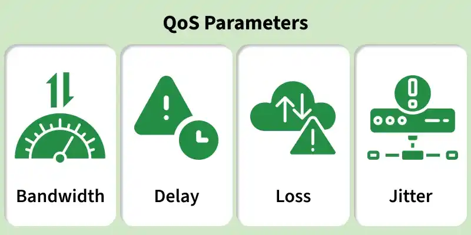
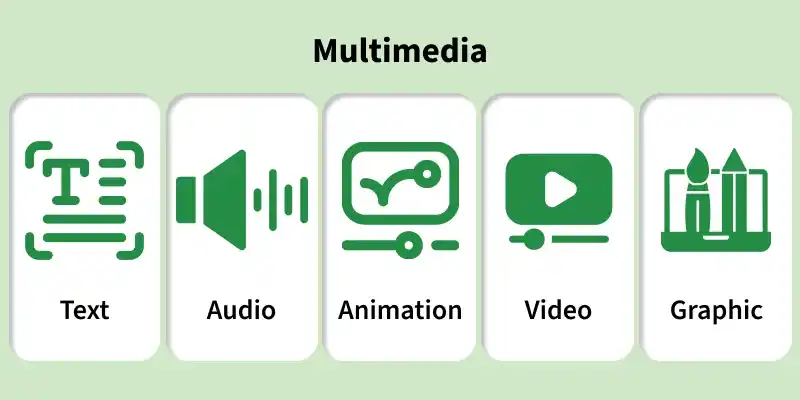
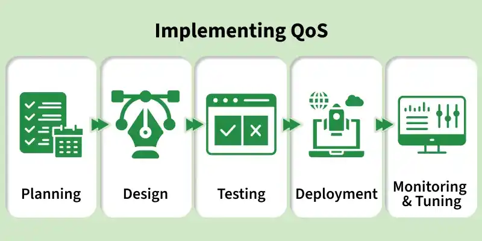

# QoS & Congestion Control

[← Back to Observability](./README.md)

Quality of Service, token/leaky bucket, techniques, congestion control.

## Table of Contents

- [Quality of Service and multimedia](#quality-of-service-and-multimedia)
- [Token bucket](#token-bucket)
- [Leaky bucket](#leaky-bucket)
- [Techniques for achieving QoS](#techniques-for-achieving-qos)
- [Congestion control (techniques)](#congestion-control-techniques)
- [References](#references)

---

## Quality of Service and multimedia

**QoS (Quality of Service)** is a set of **traffic management** mechanisms to **prioritize** and **regulate** traffic so that applications (especially **real-time** and **multimedia**) get the performance they need. Source: [GeeksforGeeks – QoS and Multimedia](https://www.geeksforgeeks.org/computer-networks/computer-network-quality-of-service-and-multimedia/).

- **Goals:** Reduce **delay variation (jitter)** and **packet loss** during congestion; **manage bandwidth** (shaping, policing); **schedule** and **queue** so high-priority traffic is served first; **classify** and **mark** packets (e.g. DSCP) so devices treat them differently.
- **QoS parameters:** **Latency** (delay), **jitter** (delay variation), **packet loss**, **throughput**, **bandwidth**, **error rate**. For **multimedia** (voice, video), latency and jitter directly affect quality; **MOS (Mean Opinion Score)** is used for voice.

The diagram below summarizes key QoS parameters used to evaluate and control network performance. Source and image: [GeeksforGeeks – Quality of Service and Multimedia](https://www.geeksforgeeks.org/computer-networks/computer-network-quality-of-service-and-multimedia/) (used with credit).

- **Multimedia:** Audio, video, and real-time streams need **predictable** delay and **low loss**. QoS **prioritizes** this traffic (e.g. via queues and scheduling) and can **reserve** or **limit** bandwidth so other traffic does not starve or overwhelm the path. The diagram below illustrates multimedia components and their relation to QoS. Source and image: [GeeksforGeeks – Quality of Service and Multimedia](https://www.geeksforgeeks.org/computer-networks/computer-network-quality-of-service-and-multimedia/) (used with credit).

---

## Token bucket

The **token bucket** algorithm **allows burst** while **limiting** the long-term rate. Source: GFG QoS, standard refs.

- **Mechanism:** A **bucket** holds **tokens** that are added at a **fixed rate** (e.g. R tokens/sec). Each packet (or byte) **consumes** one or more tokens. If tokens are **available**, the packet is **allowed** (and tokens are removed). If **not**, the packet can be **dropped** or **delayed** (policing vs shaping). The **bucket** has a **capacity** (max tokens); extra tokens up to capacity allow **bursts**.
- **Use:** **Rate limiting** and **policing** (cap traffic to a committed rate while allowing short bursts). **Traffic shaping** can be implemented with a token bucket that **queues** non-conforming traffic instead of dropping.

---

## Leaky bucket

The **leaky bucket** algorithm **smooths** traffic by **outputting** at a **constant rate** (the “leak”), regardless of input burst. Source: GFG QoS, standard refs.

- **Mechanism:** Incoming packets (or bytes) enter a **bucket** (queue). The bucket “leaks” at a **fixed** output rate. **Bursts** are **buffered**; if the bucket **overflows**, excess can be **dropped**. Result: **smoothed** output rate, which reduces **burstiness** downstream.
- **Use:** **Traffic shaping** (smooth out bursts before sending to a link or peer). Unlike token bucket, classic leaky bucket does **not** allow short bursts above the leak rate; variants combine both ideas.

---

## Techniques for achieving QoS

- **Classification and marking** — Identify traffic (e.g. by **DSCP**, **CoS**, **ACL**, or **application**) and **mark** packets so that downstream devices apply the right **queue** or **policy**. **DiffServ** uses **DSCP** in the IP header; **802.1p** uses CoS in the Ethernet header.
- **Queuing and scheduling** — **Priority queuing (PQ)**: high-priority queue is served first. **Weighted fair queuing (WFQ)** / **CBWFQ**: each class gets a **weight** or **bandwidth**. **Low-latency queuing (LLQ)** combines PQ for real-time and WFQ for the rest.
- **Policing** — **Enforce** a rate limit; **excess** traffic is **dropped** or **re-marked** (e.g. to a lower DSCP). Used at the **edge** to enforce contracts.
- **Shaping** — **Smooth** traffic to a **target rate** by **buffering** excess and sending later. Reduces **bursts** and **congestion** on the next hop. See [transport](../transport/README.md) for TCP congestion control (end-to-end).

Implementing QoS is typically done in phases: planning, design, testing, deployment, and monitoring/tuning. The diagram below illustrates this approach. Source and image: [GeeksforGeeks – Quality of Service and Multimedia](https://www.geeksforgeeks.org/computer-networks/computer-network-quality-of-service-and-multimedia/) (used with credit).

---

## Congestion control (techniques)

**Congestion control** manages **load** on the network so that **links** and **routers** are not **overwhelmed** (which causes loss and delay). Source: GFG QoS, transport layer concepts.

- **Network-side:** **QoS** (queuing, policing, shaping) **limits** or **prioritizes** traffic so that critical flows get service and **congestion** is avoided or reduced. **Active Queue Management (AQM)** (e.g. RED, CoDel) **drops** or **marks** packets **before** buffers are full to signal congestion to **TCP** and other protocols.
- **End-to-end (TCP):** **TCP congestion control** (e.g. **slow start**, **congestion avoidance**, **fast retransmit/recovery**) **reduces** the send rate when **loss** or **ECN** is detected. See [transport](../transport/README.md) (TCP flow and congestion control). **UDP** has no built-in congestion control; applications or **QUIC** implement their own.

---

## References

- [GeeksforGeeks – Quality of Service and Multimedia](https://www.geeksforgeeks.org/computer-networks/computer-network-quality-of-service-and-multimedia/) (diagrams used with credit)
- [1_Signals_Performance](./1_Signals_Performance.md); [transport/README](../transport/README.md)
