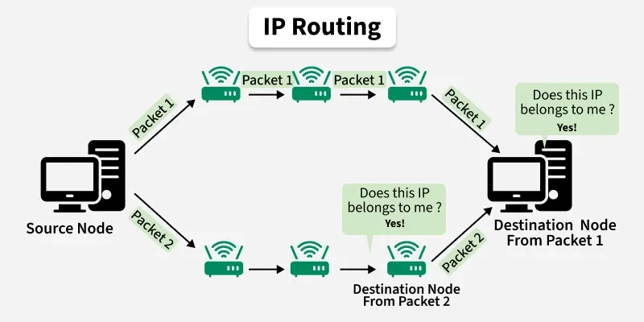
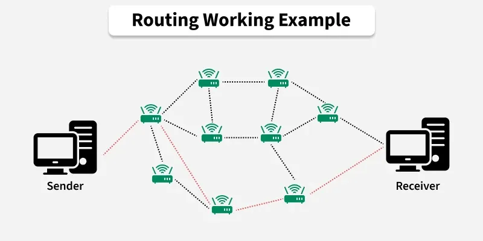

# Routing Fundamentals

[← Back to Routing & Switching](./README.md)

Forwarding vs routing, RIB/FIB, static vs dynamic, distance vector and link state.

## Table of Contents

- [What is routing?](#what-is-routing)
- [Static vs dynamic routing](#static-vs-dynamic-routing)
- [Distance vector routing](#distance-vector-routing)
- [Link state routing](#link-state-routing)
- [Routing example](#routing-example)
- [References](#references)

---

## What is routing?

**Routing** is the process of **selecting the best path** for packets to travel from source to destination across one or more networks. A **router** works at Layer 3 (network layer): it inspects the **destination IP** in each packet and consults a **routing table** to choose the **next hop** (outgoing interface and next router or destination). **Forwarding** is the act of sending the packet out the chosen interface; **routing** is building and maintaining the table (via static config or **routing protocols**). The table is often called **RIB** (Routing Information Base); the kernel or hardware may use a **FIB** (Forwarding Information Base) optimized for lookup. **Longest prefix match** is used: the route with the longest matching prefix for the destination IP is selected (e.g. 192.168.1.0/24 over 192.168.0.0/16).

The diagram below shows how a data packet is routed by analyzing its destination IP; the nearest router receives the packet and, based on metrics, forwards it toward the destination. Source and image: [GeeksforGeeks – What is Routing?](https://www.geeksforgeeks.org/computer-networks/what-is-routing/) (used with credit).



---

## Static vs dynamic routing

- **Static routing** — Routes are **configured manually** by an administrator. No protocol traffic; full control; suitable for small or stable networks. Hard to scale; changes require manual updates.
- **Dynamic routing** — Routers **exchange** reachability information via **routing protocols** (RIP, OSPF, BGP, etc.) and build tables automatically. Adapts to topology changes; scales to large networks; uses bandwidth and CPU for protocol messages.
- **Default routing** — A **default route** (e.g. 0.0.0.0/0) sends packets to a gateway when no specific route matches. Common at the edge (e.g. "everything else via this router").

**Commands (hands-on): view and manage routing table (Linux)**

```bash
# Show routing table (numeric: no DNS)
ip route show
# or
route -n

# Show default route
ip route show default

# Add a static route (e.g. 192.168.2.0/24 via 10.0.0.1) — requires root
sudo ip route add 192.168.2.0/24 via 10.0.0.1

# Delete a route
sudo ip route del 192.168.2.0/24
```

**Windows:** `route print` to view; `route add`, `route delete` to modify (run Command Prompt as Administrator).

---

## Distance vector routing

In **distance-vector** routing, each router advertises its **routing table** (or a summary) to **neighbours** at intervals. Each entry typically includes a **metric** (e.g. hop count). Routers use the **Bellman–Ford** idea: the best path to a destination is via the neighbour that reports the smallest distance. **RIP** is a distance-vector protocol (hop count, max 15). Convergence can be slow; susceptible to routing loops unless mitigations (e.g. split horizon, poison reverse) are used.

---

## Link state routing

In **link-state** routing, each router **floods** information about its **direct links** (and their cost) to all routers in the area. Every router builds the same **topology map** and runs a **shortest-path algorithm** (e.g. **Dijkstra**) to compute its routing table. Updates are sent when topology **changes**, not periodically. **OSPF** and **IS-IS** are link-state protocols. They support **VLSM**, scale well, and converge faster than naive distance-vector. See [Routing protocols](./2_Routing_Protocols.md).

---

## Routing example

A packet with destination IP **10.1.2.50** arrives at a router. The router finds the **longest matching** route: e.g. 10.1.2.0/24 via interface Eth1 to next-hop 10.1.1.1. It **decrements TTL**, rewrites the L2 header (e.g. destination MAC of 10.1.1.1 via ARP), and **forwards** the packet. The process repeats at each hop until the packet reaches the destination network. For a multi-hop path and ARP at each step, see [foundations/5_Network_Layer — Routing example](../foundations/5_Network_Layer.md#routing-example).

The diagram below illustrates the working principle: sender, routers, and receiver; the **shortest path** (e.g. by hop count) is typically chosen when metrics are satisfied. Source and image: [GeeksforGeeks – What is Routing?](https://www.geeksforgeeks.org/computer-networks/what-is-routing/) (used with credit).



---

## References

- [GeeksforGeeks – What is Routing?](https://www.geeksforgeeks.org/computer-networks/what-is-routing/) (diagrams used with credit)
- [Routing protocols](./2_Routing_Protocols.md); [Foundations – Network layer](../foundations/5_Network_Layer.md)
