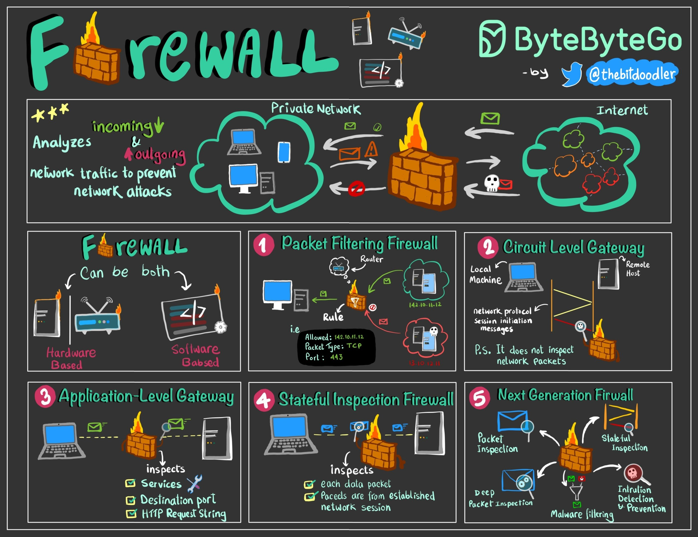
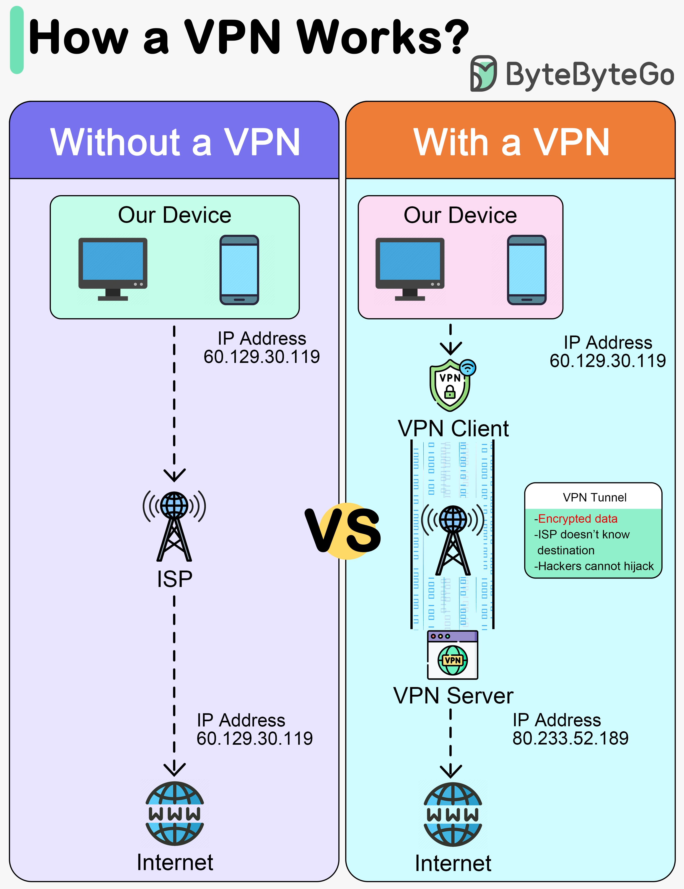

# Network Security Overview & Perimeter

[← Back to Security](./README.md)

What is network security; firewalls, MAC filtering, VPN, IDS/IPS.

## Table of Contents

- [What is network security?](#what-is-network-security)
- [Firewalls](#firewalls)
- [MAC filtering](#mac-filtering)
- [VPN](#vpn)
- [SASE and ZTNA (network perspective)](#sase-and-ztna-network-perspective)
- [IDS and IPS](#ids-and-ips)
- [References](#references)

---

## What is network security?

**Network security** protects networks and the data they carry from **unauthorized access**, **misuse**, and **cyberattacks**. It aims to keep systems **confidential**, **available**, and **trustworthy**. Source: [GeeksforGeeks – What is Network Security?](https://www.geeksforgeeks.org/computer-networks/network-security/).

- **Goals:** Safe communication; reliable operations; **confidentiality**, **integrity**, and **availability** of data; prevention of unauthorized access and threats.
- **How it works:** **Layered** controls at the network edge and inside the environment. Traffic is checked against rules; only authorized users and traffic are allowed. Layers include:
  - **Physical** — Protect hardware (routers, switches, data centers) from physical access; use access control, biometrics, CCTV, locked rooms.
  - **Technical** — Software controls: firewalls, encryption, antivirus, intrusion detection; protect data in motion and at rest.
  - **Administrative** — Policies, permissions, procedures; configuration, monitoring, compliance; authentication, authorization, roles.

**Threats** are addressed by controls such as firewalls, segmentation, access control (NAC), VPNs, IDS/IPS, and antivirus. **Physical (L1)** threats (wiretapping, rogue devices, RF jamming) and **L2/L3** attacks are in [4_Attacks_Mitigations](./4_Attacks_Mitigations.md); **reconnaissance** and **network-level offensive** measures (from a defensive view) are in [8_Reconnaissance_Offensive](./8_Reconnaissance_Offensive.md). For **blue team** defensive operations (NSM, detection, incident response, hardening, threat intel), see [9_Blue_Team_Defensive](./9_Blue_Team_Defensive.md). For **web, mobile, AI, and container** security from a network perspective (WAF, TLS, API traffic, rate limiting, certificate pinning, NetworkPolicy), see [10_Applications_Network_Perspective](./10_Applications_Network_Perspective.md). See also [3_Cybersecurity_Threats_Config](./3_Cybersecurity_Threats_Config.md).

---

## Firewalls

A **firewall** is a **network security system** (hardware or software) that **monitors and controls** traffic based on **predefined rules**. It acts as a barrier between internal systems and external networks. Source: [GeeksforGeeks – Introduction of Firewall](https://www.geeksforgeeks.org/computer-networks/introduction-of-firewall-in-computer-network/).

The diagram below illustrates how a firewall sits between trusted and untrusted networks and filters traffic. Source and image: [ByteByteGo – Firewall Explained to Kids and Adults](https://bytebytego.com/guides/firewall-explained-to-kids-and-adults/).



- **Actions:** **Accept** (allow), **Reject** (block with error), **Drop** (block silently). Best practice: **default deny** (drop or reject) for traffic not explicitly allowed.
- **Working:** Every packet is checked against rules; matches can allow or block. Blocked or unusual traffic is logged; alerts can be generated. Rules are set by the organization (e.g. by IP, port, protocol, application).
- **Types (from source):** By **placement**: packet filtering, stateful inspection, proxy (application-level), circuit-level gateway, NGFW, WAF. By **scope**: host-based (on a single host), network (perimeter device). By **form**: software, hardware. **ACLs** (access control lists) are rule sets (e.g. permit/deny by source, destination, port). **Security groups** (cloud) and **microsegmentation** apply firewall-like rules at the VM or workload level to limit lateral movement. See [5_Firewalls_Aaa](./5_Firewalls_Aaa.md) for zone-based firewalls and ASA.

---

## MAC filtering

**MAC filtering** is **device-level access control**: a router or switch **allows or blocks** devices based on their **MAC address**. Source: [GeeksforGeeks – MAC Filtering](https://www.geeksforgeeks.org/computer-networks/mac-filtering-in-computer-network/).

- **How it works:** The device sends its MAC when connecting; the router/AP checks it against an **allow list** (whitelist) or **deny list** (blacklist). Allow list = only listed MACs can connect; deny list = only listed MACs are blocked. If a MAC is in both, deny usually wins.
- **Where used:** Often on **Wi‑Fi** routers; can be enforced at the **connection layer** (device cannot join) or at **DHCP** (device joins but gets no IP). Use with **strong encryption and authentication** (e.g. WPA3), not as the only control.
- **Risks:** **MAC addresses can be spoofed**; an attacker can use an allowed MAC. MACs can be learned by sniffing. No encryption; does not protect data. **MAC randomization** (e.g. on mobile) can break allow lists. Use as an **extra layer**, not sole security. See [4_Attacks_Mitigations](./4_Attacks_Mitigations.md) (CAM table, port security).

---

## VPN

A **VPN (Virtual Private Network)** creates a **secure, encrypted** connection over a public network (e.g. the Internet). It provides **confidentiality** and **privacy** for remote access and site-to-site links. Source: GFG Network Security, A-to-Z VPN & Tunneling.

The diagram below shows how a VPN tunnels traffic between your device and a VPN server so that data is encrypted over the public internet. Source and image: [ByteByteGo – How Does a VPN Work?](https://bytebytego.com/guides/how-does-a-vpn-work/).



- **Types:** **Remote access** (user to corporate network); **site-to-site** (network to network); **cloud VPN** (on-prem to cloud). See [routing-switching/3_Tunneling_Mpls](../routing-switching/3_Tunneling_Mpls.md) (GRE) and [6_Ipsec_Vpns](./6_Ipsec_Vpns.md).
- **How it works:** Traffic is **encapsulated** (and usually **encrypted**); it is sent through a **tunnel** to the VPN gateway, which decapsulates and forwards to the internal network. The VPN can use **IPSec**, **TLS** (e.g. OpenVPN, SSL VPN), or **WireGuard**. VPN security: encrypts data, can authenticate users/devices, and (for remote access) can mask the client’s public IP. See [2_Encryption_Tls](./2_Encryption_Tls.md) and [6_Ipsec_Vpns](./6_Ipsec_Vpns.md).

---

## SASE and ZTNA (network perspective)

**SASE (Secure Access Service Edge)** and **ZTNA (Zero Trust Network Access)** are **architecture models** that combine **network connectivity** with **security** so that access is **identity- and context-aware** instead of “anyone on the corporate network is trusted.” From a **network** perspective, they change **where** and **how** traffic is routed and inspected.

### SASE (Secure Access Service Edge)

- **Idea:** Converge **WAN connectivity** (e.g. SD-WAN) and **security** (firewall, CASB, SWG, ZTNA) into a **cloud-delivered** service. Traffic from **branches** and **remote users** goes to a **SASE PoP** (point of presence) or edge node instead of first backhauling to a **data centre**; security (inspection, policy) happens at the **edge** or in the **cloud**.
- **Network impact:** **Path** of traffic changes: user or branch → **internet or private link** → **SASE gateway** → inspected and forwarded to app (internet or private). So from a **routing** standpoint, the “next hop” for many flows is the **SASE endpoint**, not the traditional VPN concentrator or HQ firewall.
- **Benefits (network view):** **Latency** can improve (traffic goes to nearest PoP, not HQ). **Scalability**: no single choke point at HQ. **Unified policy**: same security and access rules for branch and remote users.

**Visual (traffic path):**

```text
  Traditional:                          SASE:
  User → Internet → HQ firewall → App   User → Internet → SASE PoP (near user) → App
       (all traffic to HQ first)             (inspect at edge; forward to app or internet)
```

### ZTNA (Zero Trust Network Access)

- **Idea:** **Never trust by location.** Access to **applications** (or resources) is granted only after **identity** and **context** are verified; the **network** does not automatically trust someone because they are “on the corporate LAN.” Applications are **hidden** from the internet; users get **per-app** access through a **ZTNA gateway** (or broker) that authenticates and authorizes each connection.
- **Network impact:** From the **network** side: user traffic goes to the **ZTNA service** (cloud or on-prem); the service **authenticates** (e.g. device + user) and then **proxies or tunnels** only **allowed** app traffic to the app. So the **visible** path is: client → ZTNA gateway → app. The app **does not** have a public IP that anyone can try; only **authorized** sessions get through.
- **Contrast with VPN:** Classic VPN gives “you are on the network; now you can reach everything the network allows.” ZTNA gives “you can reach **only** the apps you are **explicitly** allowed to use, after we verified who you are and what device you use.”

**Visual (ZTNA vs VPN):**

```text
  VPN:  User → VPN tunnel → Corporate network → (then can reach many internal apps)
  ZTNA: User → ZTNA broker (auth) → only allowed app(s); app not on open network
```

**Takeaway:** SASE and ZTNA are **architectural**; they affect **where traffic goes** (SASE edge, ZTNA gateway), **how it is inspected**, and **who can reach what**. Understanding them from a **network** perspective helps when designing remote access, SD-WAN, and zero-trust initiatives. See [5_Firewalls_Aaa](./5_Firewalls_Aaa.md) and [10_Applications_Network_Perspective](./10_Applications_Network_Perspective.md) for policy and application-layer controls.

---

## IDS and IPS

- **IDS (Intrusion Detection System)** — **Monitors** network (or host) traffic to **detect** suspicious or malicious activity. It **alerts** and logs; it does **not** block traffic by itself. Can be **network-based (NIDS)** or **host-based (HIDS)**.
- **IPS (Intrusion Prevention System)** — Like IDS but **also blocks** (or mitigates) malicious traffic in **real time**. Inline; can drop packets, reset connections, or trigger other responses. Also called **IDPS**. Source: GFG Network Security (IPS monitors, prevents, blocks; generates logs and reports).

**Use:** IPS/IDS identify attacks (e.g. exploits, DoS patterns, policy violations). Alerts feed **SIEM** and **incident response**. Tuning is needed to limit false positives. See [7_Nids_DoS_Identity](./7_Nids_DoS_Identity.md) (Snort, DoS types) and [observability/5_Security_Monitoring](../observability/5_Security_Monitoring.md) (Zeek, Suricata).

---

## References

- [GeeksforGeeks – What is Network Security?](https://www.geeksforgeeks.org/computer-networks/network-security/) (goals, how it works, threats)
- [GeeksforGeeks – Introduction of Firewall in Computer Network](https://www.geeksforgeeks.org/computer-networks/introduction-of-firewall-in-computer-network/); [GeeksforGeeks – MAC Filtering in Computer Network](https://www.geeksforgeeks.org/computer-networks/mac-filtering-in-computer-network/)
- [ByteByteGo – Firewall Explained to Kids and Adults](https://bytebytego.com/guides/firewall-explained-to-kids-and-adults/) (diagram; used with credit); [ByteByteGo – How Does a VPN Work?](https://bytebytego.com/guides/how-does-a-vpn-work/) (diagram; used with credit)
- [4_Attacks_Mitigations](./4_Attacks_Mitigations.md) (L1–L3); [8_Reconnaissance_Offensive](./8_Reconnaissance_Offensive.md) (recon, scanning); [9_Blue_Team_Defensive](./9_Blue_Team_Defensive.md) (blue team, NSM, IR); [10_Applications_Network_Perspective](./10_Applications_Network_Perspective.md) (web, mobile, AI, containers); [5_Firewalls_Aaa](./5_Firewalls_Aaa.md); [6_Ipsec_Vpns](./6_Ipsec_Vpns.md); [7_Nids_DoS_Identity](./7_Nids_DoS_Identity.md); [observability/5_Security_Monitoring](../observability/5_Security_Monitoring.md)
