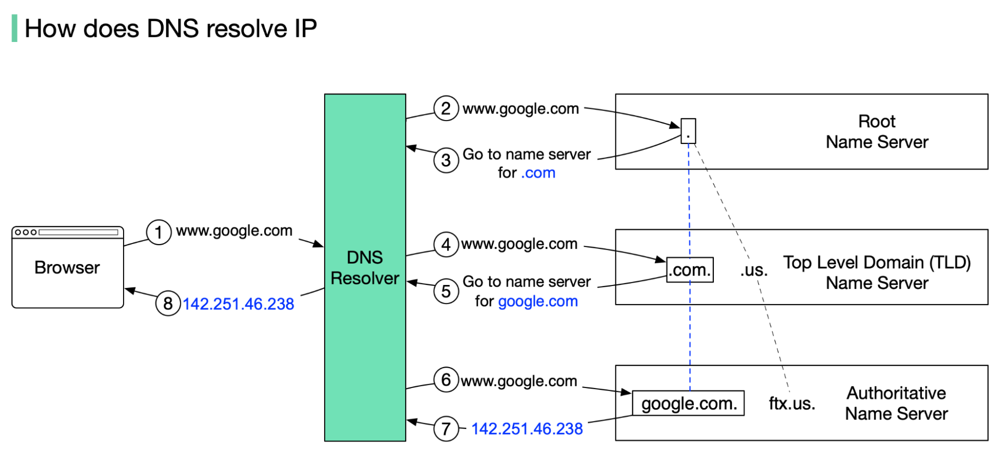
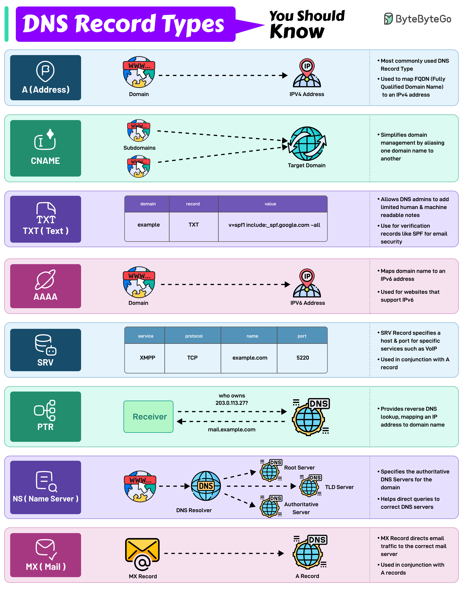

# DNS

[← Back to Services](./README.md)

Deep dive: what DNS is, types of DNS (servers and roles), why DNS exists, record types, resolution and caching, and DNS-based load balancing.

## Table of Contents

- [What is DNS and why does it exist?](#what-is-dns-and-why-does-it-exist)
- [Types of DNS (servers and roles)](#types-of-dns-servers-and-roles)
- [DNS record types](#dns-record-types)
- [Resolution paths and caching](#resolution-paths-and-caching)
- [DNS-based load balancing](#dns-based-load-balancing)
- [Split-horizon DNS](#split-horizon-dns)
- [DNS over HTTPS / DNS over TLS](#dns-over-https--dns-over-tls)
- [DNS over QUIC (DoQ)](#dns-over-quic-doq)
- [References](#references)

---

## What is DNS and why does it exist?

**DNS (Domain Name System)** is a **hierarchical, distributed** naming system that **maps domain names** (e.g. www.example.com) to **IP addresses** (and other data). It exists so users and applications can use **human-readable names** instead of numeric addresses; it **scales** via **delegation** (each zone is managed by authoritative servers) and **caching**. Use cases: web browsing, email (MX), service discovery (SRV), verification (TXT, CAA), reverse lookups (PTR). Without DNS, every service would need to be reached by raw IP.

---

## Types of DNS (servers and roles)

- **Stub resolver** — On the client (e.g. OS); sends a single query (usually to a **recursive resolver**) and returns the result.
- **Recursive resolver** — Receives client queries and **resolves** them by following the chain: root → TLD → authoritative. Returns the final answer to the client; often caches results (e.g. ISP resolver, 1.1.1.1, 8.8.8.8).
- **Authoritative server** — Holds the **authoritative** records for a zone (e.g. example.com). **Primary** holds the master data; **secondary** gets it via zone transfer. Answers with **authoritative** data or referral (e.g. to TLD or another authoritative server).
- **Forwarder** — A resolver that forwards queries to another resolver instead of doing full recursion itself.

**Resolution flow (code-block):**

```text
  Client (stub resolver)  →  Recursive resolver  →  Root server (referral to .com)
                                                           ↓
  Client  ←  answer  ←  Recursive  ←  Authoritative  ←  TLD server (referral to example.com)
```

So: the client asks the **recursive resolver**; the resolver **iteratively** queries root → TLD → authoritative, then returns the **final answer** to the client. The client typically sees a single request/response. Source: [ByteByteGo – How Does the Domain Name System (DNS) Lookup Work?](https://bytebytego.com/guides/how-does-the-domain-name-system-dns-lookup-work/).



---

## DNS record types

The most common and important DNS record types are summarized below. Use them to map names to IPs, delegate zones, route email, and verify ownership. Source and diagram: [ByteByteGo – DNS Record Types You Should Know](https://bytebytego.com/guides/dns-record-types-you-should-know/).



| Record | Purpose | Example |
|--------|---------|---------|
| **A** | Domain → IPv4 | example.com → 93.184.216.34 |
| **AAAA** | Domain → IPv6 | example.com → 2606:2800:220:1:248:1893:25c8:1946 |
| **CNAME** | Alias → canonical name | www.example.com → example.com |
| **MX** | Mail server for domain | example.com → mail.example.com (priority 10) |
| **NS** | Delegation to name server | example.com → ns1.example.com |
| **PTR** | Reverse: IP → name | 34.216.184.93.in-addr.arpa → example.com |
| **TXT** | Text (verification, SPF, DKIM, etc.) | example.com → "v=spf1 ..." |
| **SOA** | Start of authority (zone metadata, serial, refresh) | Zone parameters |
| **SRV** | Service (protocol, port, target) | _http._tcp.example.com → server:80 |
| **CAA** | Which CAs may issue certs | example.com → ca.example.com |

**TTL** on each record controls how long resolvers and caches may store it before re-querying.

---

## Resolution paths and caching

**Commands (hands-on): query DNS from your machine**

These tools send queries to your configured resolver (or a specified server) and show the response. Useful for debugging resolution and verifying record types.

```bash
# nslookup: simple A record (default), interactive or one-shot
nslookup example.com
nslookup -type=A example.com
nslookup -type=MX example.com
nslookup -type=NS example.com
# Use a specific resolver (e.g. Google 8.8.8.8)
nslookup example.com 8.8.8.8
```

```bash
# dig: detailed output; shows answer, authority, additional sections
dig example.com
dig example.com A
dig example.com MX +short
dig @8.8.8.8 example.com
# Trace recursion (shows path: root → TLD → auth)
dig +trace example.com
```

```bash
# host: compact output
host example.com
host -t MX example.com
host 93.184.216.34   # reverse (PTR) lookup
```

```powershell
# Windows: nslookup (same idea)
nslookup example.com
nslookup -type=MX example.com
```

- **Recursive resolution** — The recursive resolver follows referrals (root → TLD → authoritative) until it gets the answer, then returns it to the client. The client sees one request and one response.
- **Iterative resolution** — The client (or resolver) queries one server, gets a referral, then queries the next; each step is a separate query. Authoritative servers typically respond **iteratively** (give referral or answer, do not do recursion).
- **Caching** — Resolvers cache responses for the **TTL** of the record. Reduces load and latency. **Negative caching** (caching “no such name” or errors) is also common for a short time.
- **Root** servers return referrals to **TLD** servers (.com, .org, etc.); TLD servers return referrals to **authoritative** servers for each domain.

---

## DNS-based load balancing

You can list **multiple A or AAAA records** for one name. Resolvers may return them in varying order; clients often use the **first** or pick randomly. So **round-robin DNS** (rotating the order of records per response) distributes requests across several IPs. **Weighted** schemes (if supported) or **geo-based** responses (different answers by client location) give coarse load distribution. **Limitations:** clients and intermediate caches may reuse one IP for the TTL; no visibility into server health or actual load. For fine-grained control use **L4 or L7 load balancers**; see [Load balancing & proxies](./4-load-balancing-proxies.md).

---

## Split-horizon DNS

**Split-horizon DNS** (split DNS, views) means **internal** clients get different answers than **external** clients for the same name. Example: inside the company, `mail.example.com` resolves to a **private** IP; from the internet it resolves to a **public** IP. Used for security, avoiding NAT hairpinning, and directing internal traffic to internal servers. Implemented by resolvers/authoritative servers that choose the response based on client IP or identity.

---

## DNS over HTTPS / DNS over TLS

**DoH (DNS over HTTPS)** and **DoT (DNS over TLS)** send DNS queries over **encrypted** channels (HTTPS or TLS on port 853) instead of plain UDP/TCP port 53. This **prevents** on-path observers from seeing or tampering with individual queries and responses; it can also improve privacy. DoH is often used from browsers to a designated DoH server; DoT is common for system-wide or resolver-to-resolver use. Both are independent of **DNSSEC**, which signs records for integrity and authenticity.

---

## DNS over QUIC (DoQ)

**DoQ (DNS over QUIC)** is an **encrypted** DNS protocol that carries DNS queries and responses over **QUIC** (RFC 9250). Like DoH and DoT, it hides query content from on-path observers and resists tampering; it adds **QUIC’s** benefits: **low latency** (0-RTT resumption, no TCP handshake), **multiplexing** without head-of-line blocking, and **connection migration** (e.g. when the client changes network).

**From a network perspective:**

- **Transport:** DoQ uses **UDP** (typically port **853**, same as DoT; or **784** for the dedicated DoQ port). So on the wire you see **UDP** to the resolver; the payload is **QUIC** (encrypted), and inside QUIC are DNS messages. **Firewalls** and **middleboxes** that allow **DoT** (UDP 853) or **DoQ** (UDP 784) need to permit this traffic if you use DoQ.
- **Comparison:** **DoH** = DNS over **HTTP/2** (or HTTP/3 over QUIC) on **port 443**; **DoT** = DNS over **TLS** on **TCP 853**; **DoQ** = DNS over **QUIC** on **UDP 853 or 784**. DoQ avoids TCP’s head-of-line blocking and can reduce latency when many queries are in flight.
- **Adoption:** DoQ is **standardized** (RFC 9250) and supported by some resolvers (e.g. Cloudflare, Google); client and stub-resolver support is growing. It is part of the “encrypted DNS” family alongside DoH and DoT.

**Visual (encrypted DNS options):**

```text
  Client (stub resolver)                    Resolver
  ┌─────────────┐                           ┌─────────────┐
  │ DNS query    │  DoH:  HTTPS (TCP 443)   │  Encrypted  │
  │ (plaintext   │  DoT:  TLS (TCP 853)     │  channel    │
  │  inside      │  DoQ:  QUIC (UDP 853/784)│  → decrypt  │
  │  encrypted   │  ────────────────────────► │  → resolve  │
  │  channel)   │                           │  → respond  │
  └─────────────┘                           └─────────────┘
```

**Takeaway:** DoQ is another **encrypted DNS** option; from a **network** view you care about **UDP** and **ports 853/784**, and that traffic is **opaque** (QUIC encrypted) like DoT/DoH. See [transport/6-other-protocols](../transport/6-other-protocols.md#quic) for QUIC basics.

---

## References

- [ByteByteGo – How Does the Domain Name System (DNS) Lookup Work?](https://bytebytego.com/guides/how-does-the-domain-name-system-dns-lookup-work/) (diagram; used with credit)
- [ByteByteGo – DNS Record Types You Should Know](https://bytebytego.com/guides/dns-record-types-you-should-know/) (diagram; used with credit)
- [GeeksforGeeks – Domain Name System (DNS)](https://www.geeksforgeeks.org/computer-networks/domain-name-system-dns-in-application-layer/)
- [Load balancing & proxies](./4-load-balancing-proxies.md)
